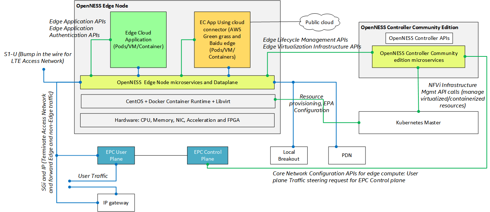

# OpenNESS Architecture

* [Overview](#overview)
 * [OpenNESS Controller Community edition](#openness-controller-community-edition)
 * [OpenNESS Edge Node](#node)
* [On-Premise Edge cloud](#onprem)
* [Network edge cloud](#netkedge)
* [OpenNESS API](#api)
 * [Edge Application APIs](#eaa)
 * [Edge Application Authentication APIs](#auth)
 * [Edge Lifecycle Management APIs](#ela)
 * [Edge Virtualization Infrastructure APIs](#eva)
 * [EPC Configuration APIs for edge cloud](#epc)
* [Edge cloud applications](#edgeapps)
 * [Producer Application](#prod)
 * [Consumer Application](#cons)
 * [Cloud Adapter Edge cloud Application](#cons)
* [OpenNESS steps to get started](#testdrive)

## Overview
OpenNESS is a opensource Edge cloud reference stack. It enables provides edge cloud reference deployments for Network edge and On-Premise Edge. OpenNESS is intended for Customers like Operators to conduct lab/field trials of edge cloud in Network edge and On-Premise Edge, ISVs or OSVs to develop edge cloud infrastructure solution that takes advantages of goodness of Intel Architecture and Application developers who intend to develop application for the edge, port the applications from public cloud to edge to take advantage of being closer to user. OpenNESS drives inspiration from ETSI MEC architecture addressing both Network edge and On-Premise Edge cloud deployments.

OpenNESS based edge cloud reference stack consists of one or more OpenNESS Edge node that hosts edge cloud applications or serve local breakout servers and an edge cloud OpenNESS controller (Community edition) that manages the OpenNESS edge cloud nodes. 

OpenNESS reference edge stack combines the NFV infrastructure optimizations for Virtual machine and Container cloud on Intel Architecture (CPU,Memory,IO and Acceleration) from various opensource projects with right amount of Edge cloud specific APIs and network abstraction on to provide a unique and one window development solution for edge cloud. 

## OpenNESS Controller Community edition
OpenNESS Controller Community edition consists of set of microservices that implement the following functionality to enable edge cloud node and application management. Community edition implements the right set of functions needed for a reference Edge cloud controller.
- Web UI front end: HTML5 based web frontend for managing edge cloud.
- User account management: Create administrator user for the edge cloud management. 
- Edge cloud application image repository: Provide edge cloud application image (VM/Container image) upload capability to the controller. 
- Configure CUPS EPC: Using reference REST API to configure 4G EPC control plane 
- Edge application life cycle management: Support set of APIs that enable
  - Enrolling OpenNESS edge node
  - Configure the interfaces and OpenNESS edge node microservices 
  - Configure the Local break out interfaces and policy 
  - Deploy edge cloud applications from the image repository 
  - Configure the Edge cloud application specific Traffic policy 
  - Configure the Edge cloud application specific DNS policy 
- Edge virtualization infrastructure management: Use the existing industry standard NFV infrastructure API to stacks like Kubernetes or Libvert or Docker to start and stop edge cloud applications on the Edge node
- Telemetry: Get basic edge cloud microservices telemetry from connected Edge nodes 

