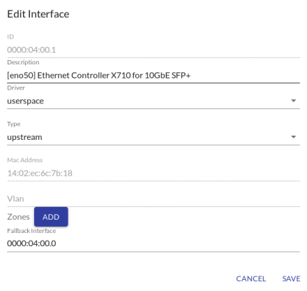
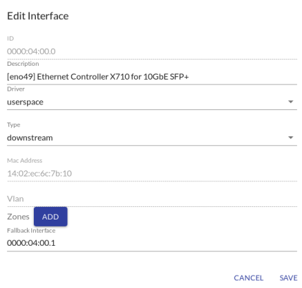

```text
SPDX-License-Identifier: Apache-2.0     
Copyright (c) 2019 Intel Corporation
```

- [Introduction](#introduction)
- [Building Applications](#building-applications)
  - [Building the OpenVINO Application images](#building-the-openvino-application-images)
- [Onboarding OpenVINO applications](#onboarding-openvino-applications)
  - [Prerequisites](#prerequisites)
  - [Setting up Network Interfaces](#setting-up-network-interfaces)
  - [Starting traffic from Client Simulator](#starting-traffic-from-client-simulator)

# Introduction
The aim of this guide is to familiarize the user with the OpenNESS application on-boarding process for the OnPremises mode. This guide will provide instructions on how to deploy an application from the Edge Controller on Edge Nodes; it will provide sample deployment scenarios and traffic configuration for the application. The applications will be deployed from Edge Controller UI webservice.

# Building Applications
User needs to prepare the applications that will be deployed on the OpenNESS platform in OnPromises mode. Applications should be built as Docker images and should be hosted on some HTTPS server that is available to the EdgeNode.

The OpenNESS [EdgeApps](https://github.com/otcshare/edgeapps) repository provides images for OpenNESS supported applications. They should be downloaded on machine where docker is installed.

## Building the OpenVINO Application images
The OpenVINO application is available in this [location in EdgeApps repository](https://github.com/otcshare/edgeapps/tree/master/openvino), further information about the application is contained within `Readme.md` file.

To build sample application Docker images for testing OpenVINO consumer and producer applications the following steps are required:

1. To build the producer application image from the application directory navigate to the `./producer` directory and run:
   ```
   ./build-image.sh
   ``` 
    **Note**: Only CPU inference support is currently available for OpenVINO application on OpenNESS Network Edge - environmental variable `OPENVINO_ACCL` must be set to `CPU` within Dockerfile available in the directory

2. To build the consumer application image from application directory navigate to the `./consumer` directory and run:
   ```
   ./build-image.sh
   ``` 
3. Check that the images built successfully and are available in local Docker image registry:
   ```
   docker images | grep openvino-prod-app
   docker images | grep openvino-cons-app
   ```

Both images should be extracted from local docker repository to archive file and uploaded to HTTPS server that will be used by EdgeNode to download and deploy the images.

    ```
    docker save -o openvino-prod-app.tar openvino-prod-app
    docker save -o openvino-cons-app.tar openvino-cons-app
    ```

An application to generate sample traffic is provided. The application should be built on separate host which will generate the traffic.

1. To build the client simulator application image from application directory navigate to the `./clientsim` directory and run: 
   ```
   ./build-image.sh
   ``` 
2. Check that the image built successfully and is available in local Docker image registry:
   ```
   docker images | grep client-sim
   ```

# Onboarding OpenVINO applications
## Prerequisites

* OpenNESS for OnPremises is fully installed and EdgeNode is enrolled to the EdgeController.
* The Docker images for the OpenVINO are available on HTTPS server and can be accessed by EdgeNode.
* A separate host used for generating traffic via Client Simulator is set up.
* The Edge Node host and traffic generating host are connected together point to point via unused physical network interfaces.
* A separate host or VM acts as gateway is used for NTS learning. It should be connected to the Edge Node via physical network interface as well.
* The Docker image for Client Simulator application is available on the traffic generating host.

## Setting up Network Interfaces

1. OpenVINO client host machine should have one of its physical interfaces connected to EdgeNode machine. IP address on this interface needs to be set to provide correct packets routing. Set it up using `ip` command:
   ```
   ip a a 192.168.10.10/24 dev <client_interface_name>
   ```

2. Gateway machine should have ip set as well on interface connected to the Edge Node:
    ```
    ip a a 192.168.10.9/24 dev <gateway_interface_name>
    ```

3. Log in to the EdgeController UI. Move to Traffic Policies page and using the form add three policies according to the instruction below:
   * to_ENB policy with:
     * Priority: 1
       * Destination:
         * IP Filter Address: 192.168.10.10 (OpenVINO client address)
         * IP Filter Mask: 32
       * Target action: accept

    * to_DP policy with:
      * Priority: 1
        * Source:
          * IP Filter Address: 192.168.10.10 (OpenVINO client address)
          * IP Filter Mask: 32
      * Target action: accept

    * openvino policy with:
      * Priority: 99
      * Source:
        * IP Filter Address: 192.168.10.10 (OpenVINO client address)
        * IP Filter Mask: 24
      * Destination:
        * IP Filter Address: 192.168.10.11 (OpenVINO app address)
        * IP Filter Mask: 24
        * Protocol: All
      * Target action: accept

4. Move to the EdgeNode interfaces setup. It should be available under button `Edit` next to the EdgeNode position on Dashboard page.
   * Find the port that is directly connected to the OpenVINO client machine port (eg. 0000:04:00.1)
     * Add to_ENB policy to it
     * Edit interface settings:

    

    Note: Fallback interface address is the one define below

    * Find the port that is directly connected to the gateway machine (eg. 0000:04:00.0)
      * Add to_DP policy to it
      * Edit interface settings:

 

Note: Fallback interface address is the one define above

5. Commit those changes to start NTS
6. Create OpenVINO producer and consumer applications and deploy them on the node. When the applications has `Deployed` status start them with 10 seconds distance to let the producer to subscribe to the platform.
   
 

 Note: Deployment of consumer application should be done by analogy

  

7. Add openvino traffic policy to consumer app
8. Log in to the consumer container and set IP address using
    ```
    docker exec -it <docker_id> /bin/bash
    ip link set dev vEth2 arp off
    ip a a 192.168.10.11/24 dev vEth2
    ip link set dev vEth2 up
    wget 192.168.10.10 -Y off 
    ```
9.  Modify `analytics.openness` entry in /etc/hosts with IP address set in step 1 (separate interface on OpenVINO client machine/VM)
10. Send ping from OpenVINO client platform to gateway using 192.168.10.9 IP address
11. On EdgeNode platform run `./edgenode/internal/nts/client/build/nes_client and check if NTS configured KNI interfaces correctly

## Starting traffic from Client Simulator

1. On the traffic generating host build the image for the [Client Simulator](#building-openvino-application-images), before building the image, in `tx_video.sh` in the directory containing the image Dockerfile edit the RTP endpoint with IP address of OpenVINO consumer application pod (to get IP address of the pod run: `kubectl exec -it openvino-cons-app ip a`)
2. Run the following from [edgeapps/openvino/clientsim](https://github.com/otcshare/edgeapps/blob/master/openvino/clientsim/run-docker.sh) to start the video traffic via the containerized Client Simulator. Graphical user environment is required to observed the results of the returning augmented videos stream.
   ```
   ./run_docker.sh
   ```

> **NOTE:** If a problem is encountered when running the `client-sim ` docker as `Could not initialize SDL - No available video device`. Disable SELinux through this command:
>  ```shell
>  $ setenforce 0
>  ```

> **NOTE:**  If the video window is not popping up and/or an error like `Could not find codec parameters for stream 0` appears, add a rule in firewall to permit ingress traffic on port `5001`:
>  ```shell
>  firewall-cmd --permanent --direct --add-rule ipv4 filter INPUT 0 -p tcp --dport 5001 -j ACCEPT
>  firewall-cmd --reload
>  ```
