```text
SPDX-License-Identifier: Apache-2.0
Copyright (c) 2019 Intel Corporation
```

- [Introduction](#introduction)
  - [Instructions to setup HTTPD server for images](#instructions-to-setup-httpd-server-for-images)
    - [How to setup apache step by step for IP address](#how-to-setup-apache-step-by-step-for-ip-address)
    - [Instruction to generate certificate for a domain](#instruction-to-generate-certificate-for-a-domain)
    - [Instruction to upload and access images](#instruction-to-upload-and-access-images)
    - [Instruction to create Traffic Policy and assign it to Interface](#instruction-to-create-traffic-policy-and-assign-it-to-interface)
      - [Creating Traffic Policy](#creating-traffic-policy)
      - [Adding Traffic Policy to Interface](#adding-traffic-policy-to-interface)
- [Building Applications](#building-applications)
  - [Building the OpenVINO Application images](#building-the-openvino-application-images)
- [Onboarding applications](#onboarding-applications)
  - [Onboarding container / VM application](#onboarding-container--vm-application)
    - [Prerequisites](#prerequisites)
    - [Creating application](#creating-application)
    - [Deploying application steps](#deploying-application-steps)
  - [Onboarding OpenVINO applications](#onboarding-openvino-applications)
    - [Prerequisites](#prerequisites-1)
    - [Setting up Network Interfaces](#setting-up-network-interfaces)
    - [Starting traffic from Client Simulator](#starting-traffic-from-client-simulator)

# Introduction
The aim of this guide is to familiarize the user with the OpenNESS application on-boarding process for the OnPremises mode. This guide will provide instructions on how to deploy an application from the Edge Controller on Edge Nodes; it will provide sample deployment scenarios and traffic configuration for the application. The applications will be deployed from Edge Controller UI webservice.

## Instructions to setup HTTPD server for images

### How to setup apache step by step for IP address
1. Install apache and mod_ssl: 
```
 yum -y install httpd mod_ssl
```
2. Go into `/etc/ssl/certs`:
```
cd /etc/ssl/certs
```
3. Acquire the controller root ca and key
```
docker cp edgecontroller_cce_1:/artifacts/certificates/ca/cert.pem .
docker cp edgecontroller_cce_1:/artifacts/certificates/ca/key.pem .
```
4. Generate the apache key and crt for IP address
```
openssl genrsa -out apache.key 2048
openssl req -new -key apache.key -out apache.csr
```
5. Edit `/etc/pki/tls/openssl.cnf` and add
```
[ req_ext ]
subjectAltName=IP:<your_ip_address>
```
6. Generate apache certificate
```
openssl x509 -req -in apache.csr -CA cert.pem -CAkey key.pem -CAcreateserial -out apache.crt -days 500 -sha256 -extensions req_ext -extfile /etc/pki/tls/openssl.cnf
```
7. Edit apache config and point it to the new certs
```
sed -i 's|^SSLCertificateFile.*$|SSLCertificateFile /etc/ssl/certs/apache.crt|g' /etc/httpd/conf.d/ssl.conf
sed -i 's|^SSLCertificateKeyFile.*$|SSLCertificateKeyFile /etc/ssl/certs/apache.key|g' /etc/httpd/conf.d/ssl.conf
```
8. Set the firewall to accept the traffic
```
firewall-cmd --permanent --direct --add-rule ipv4 filter INPUT 0 -p tcp --dport 80 -j ACCEPT
firewall-cmd --permanent --direct --add-rule ipv4 filter INPUT 0 -p tcp --dport 443 -j ACCEPT
```
9. Enable and restart apache after the changes
```
systemctl enable httpd
systemctl restart httpd
```

### Instruction to generate certificate for a domain
```
openssl genrsa -out apache.key 2048
openssl req -new -sha256 -key apache.key -subj "/C=IE/ST=Clare/O=ESIE/CN=$(hostname -f)" -out apache.csr
openssl x509 -req -in apache.csr -CA cert.pem -CAkey key.pem -CAcreateserial -out apache.crt -days 500 -sha256
```

### Instruction to upload and access images
You have to put the images into `/var/www/html`
```
cp test_image.tar.gz /var/www/html/
chmod a+r /var/www/html/*
```
The URL (Source in Controller UI) should be constructed as: `https://controller_hostname/test_image.tar.gz`

### Instruction to create Traffic Policy and assign it to Interface

#### Creating Traffic Policy

Prerequisites:

- Enrollment phase completed successfully.
- User is logged in to UI.

The steps to create a sample traffic policy are as follows:

1. From UI navigate to 'TRAFFIC POLICIES' tab.
2. Click 'ADD POLICY'.

> Note: This specific traffic policy is only an example.

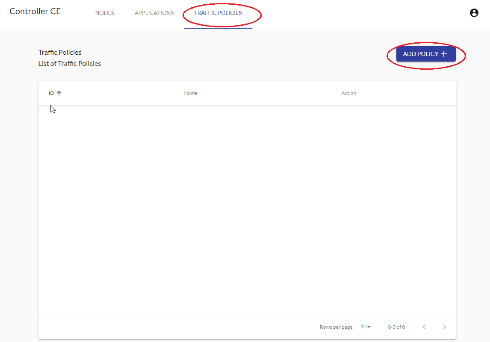

3. Give policy a name.
4. Click 'ADD' next to 'Traffic Rules*' field.
5. Fill in following fields:

- Description: "Sample Description"
- Priority: 99
- Source -> IP Filter -> IP Address: 1.1.1.1
- Source -> IP Filter -> Mask: 24
- Source -> IP Filter -> Begin Port: 10
- Source -> IP Filter -> End Port: 20
- Source -> IP Filter -> Protocol: all
- Target -> Description: "Sample Description"
- Target -> Action: accept

6. Click on "CREATE".

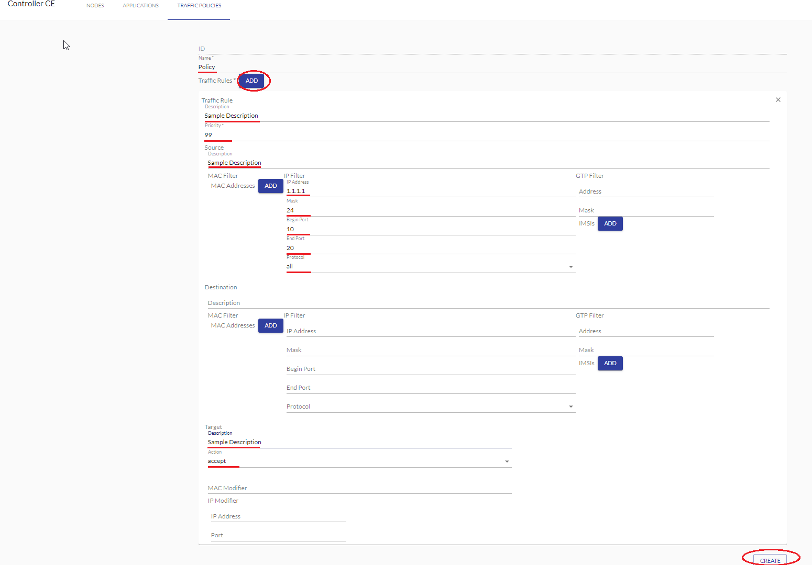

After creating Traffic Policy it will be visible under 'List of Traffic Policies' in 'TRAFFIC POLICIES' tab.

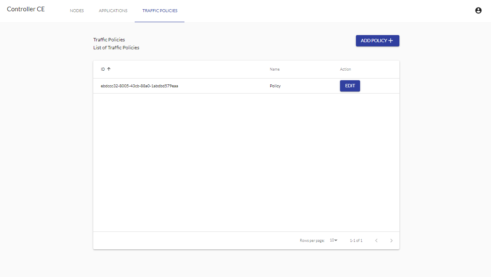

#### Adding Traffic Policy to Interface

Prerequisites:

- Enrollment phase completed successfully.
- User is logged in to UI.
- Traffic Policy Created.

To add a previously created traffic policy to an interface available on Edge Node the following steps need to be completed:

1. From UI navigate to "NODES" tab.
2. Find Edge Node on the 'List Of Edge Nodes'.
3. Click "EDIT".

> Note: This step is instructional only, users can decide if they need/want a traffic policy designated for their interface, or if they desire traffic policy designated per application instead.


4. Navigate to "INTERFACES" tab.
5. Find desired interface which will be used to add traffic policy.
6. Click 'ADD' under 'Traffic Policy' column for that interface.
7. A window titled 'Assign Traffic Policy to interface' will pop-up. Select a previously created traffic policy.
8. Click on 'ASSIGN'.


On success the user is able to see 'EDIT' and 'REMOVE POLICY' buttons under 'Traffic Policy' column for desired interface. These buttons can be respectively used for editing and removing traffic rule policy on that interface.

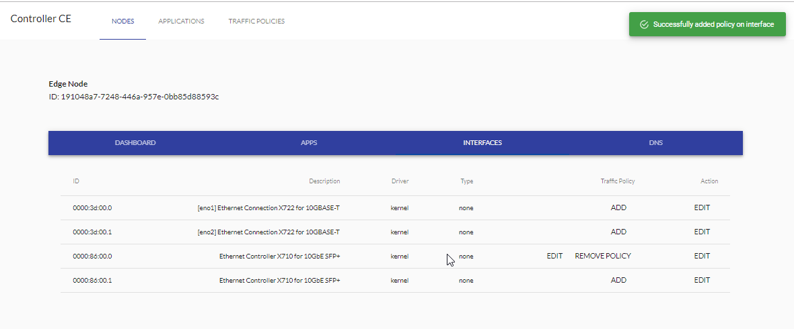

# Building Applications
User needs to prepare the applications that will be deployed on the OpenNESS platform in OnPremises mode. Applications should be built as Docker container images or VirtualBox vm images and should be hosted on some HTTPS server that is available to the EdgeNode. Format for a docker application image is .tar.gz, format for a VirtualBox one is qcow2.
Currently the applications are limited to 4096 MB RAM and 8 cores. Memory limit can be rised up to 16384 in eva.json file.

The OpenNESS [EdgeApps](https://github.com/open-ness/edgeapps) repository provides images for OpenNESS supported applications. They should be downloaded on machine where docker is installed.

## Building the OpenVINO Application images
The OpenVINO application is available in this [location in EdgeApps repository](https://github.com/open-ness/edgeapps/tree/master/openvino), further information about the application is contained within `Readme.md` file.

To build sample application Docker images for testing OpenVINO consumer and producer applications the following steps are required:

1. To build the producer application image from the application directory navigate to the `./producer` directory and run:
   ```
   ./build-image.sh
   ``` 
    **Note**: Only CPU inference support is currently available for OpenVINO application on OpenNESS Network Edge - environmental variable `OPENVINO_ACCL` must be set to `CPU` within Dockerfile available in the directory

2. To build the consumer application image from application directory navigate to the `./consumer` directory and run:
   ```
   ./build-image.sh
   ``` 
    **Note**: Default consumer inference process is using 'CPU 8' to avoid conflicts with NTS. If the desired CPU is changed, environmental variable `OPENVINO_TASKSET_CPU` must be set within Dockerfile available in the directory
    **NOTE**: fwd.sh is using 'CPU 1'. If the desired CPU is changed, user can change fwd.sh accordingly.
3. Check that the images built successfully and are available in local Docker image registry:
   ```
   docker images | grep openvino-prod-app
   docker images | grep openvino-cons-app
   ```

Both images should be extracted from local docker repository to archive file and uploaded to HTTPS server that will be used by EdgeNode to download and deploy the images.

    ```
    docker save -o openvino-prod-app.tar openvino-prod-app
    docker save -o openvino-cons-app.tar openvino-cons-app
    ```

An application to generate sample traffic is provided. The application should be built on separate host which will generate the traffic.

1. To build the client simulator application image from application directory navigate to the `./clientsim` directory and run: 
   ```
   ./build-image.sh
   ``` 
2. Check that the image built successfully and is available in local Docker image registry:
   ```
   docker images | grep client-sim
   ```

# Onboarding applications

## Onboarding container / VM application

### Prerequisites

- Enrollment phase completed successfully.
- User is logged in to UI.
- NTS must be started.
- User has an access to a HTTPS server providing a downloadable copy of Docker container image or VM image.
- A saved copy of Docker image or VM image in a location accessible by above HTTPS server.

### Creating application

To add an application to list of applications managed by Controller following steps need to be taken:

- From UI navigate to 'APPLICATIONS' tab.
- Click on 'ADD APPLICATION' button.


- After 'Add an Application' window pops up add details as per following example:
  - Name: SampleApp
  - Type: Container
  - Version: 1
  - Vendor: vendor
  - Description: description
  - Cores: 2
  - Memory: 100
  - Source: https://controller_hostname/image_file_name 
- Controllers hostname (or hostname of any other machine serving as HTTPS server) can be found by running ```hostname -f``` from terminal of that machine.
- Then memory unit used is MB. A sample path to image could be https://controller_hostname/sample_docker_app.tar.gz
- The hostname of the controller or server serving HTTPS can be checked by running: ```hostname -f``` command from servers terminal.
- Click 'UPLOAD APPLICATION'

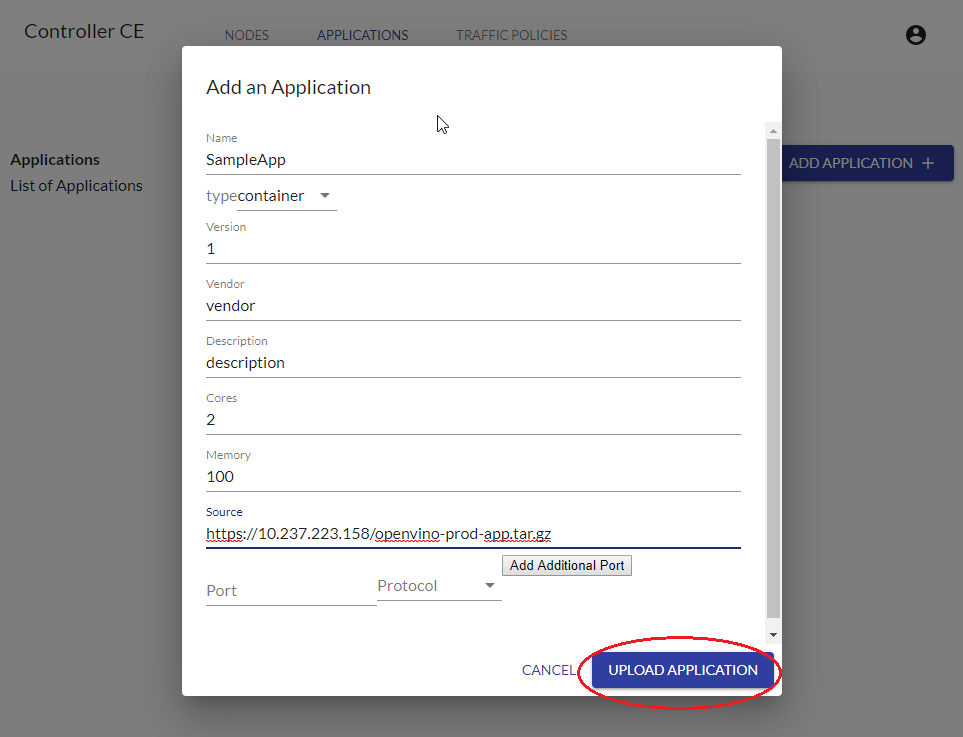

- The application will be displayed in Controller's 'List of Applications'.

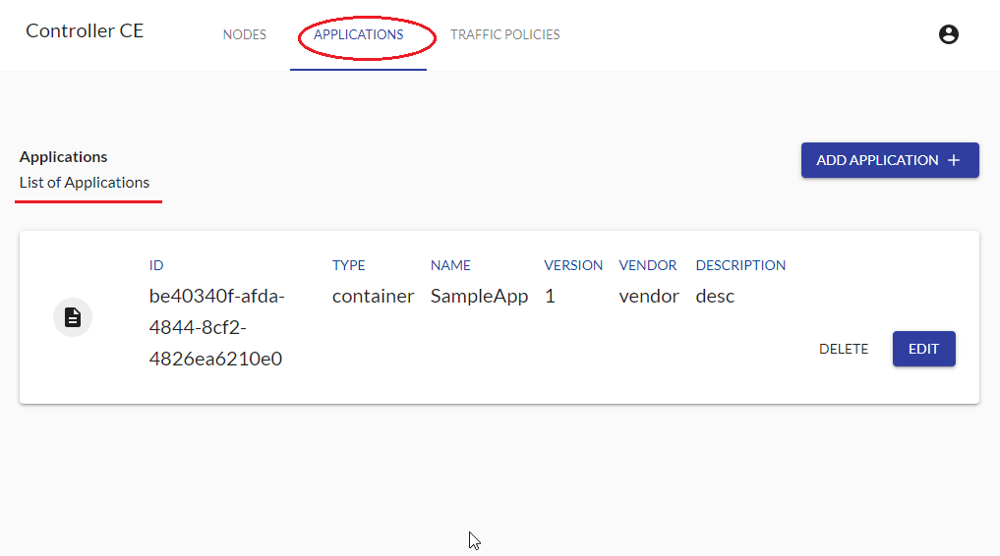

### Deploying application steps

The following steps need to be done:

- From UI go to "NODE" tab and click on "EDIT" button for the desired node.
- Navigate to "APPS" tab.
- Click on "DEPLOY APP".


- Window titled "DEPLOY APPLICATION TO NODE" will appear.
- Select the Application you want to deploy from drop down menu.
- Click "DEPLOY".


- Your applications will be listed under "APPS" tab - the status of this app will be "deployed".
- From here to start the Application click "START"

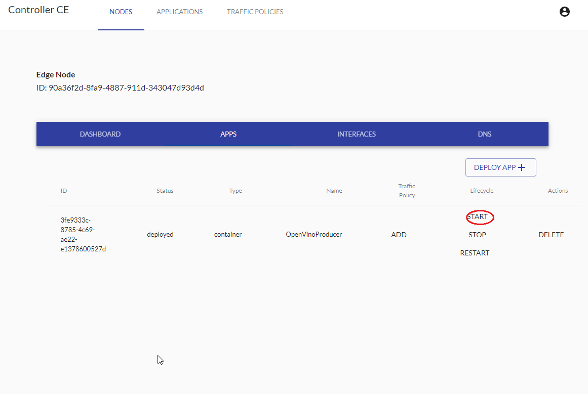

- Refresh the browser window to see the change in the status to "running".

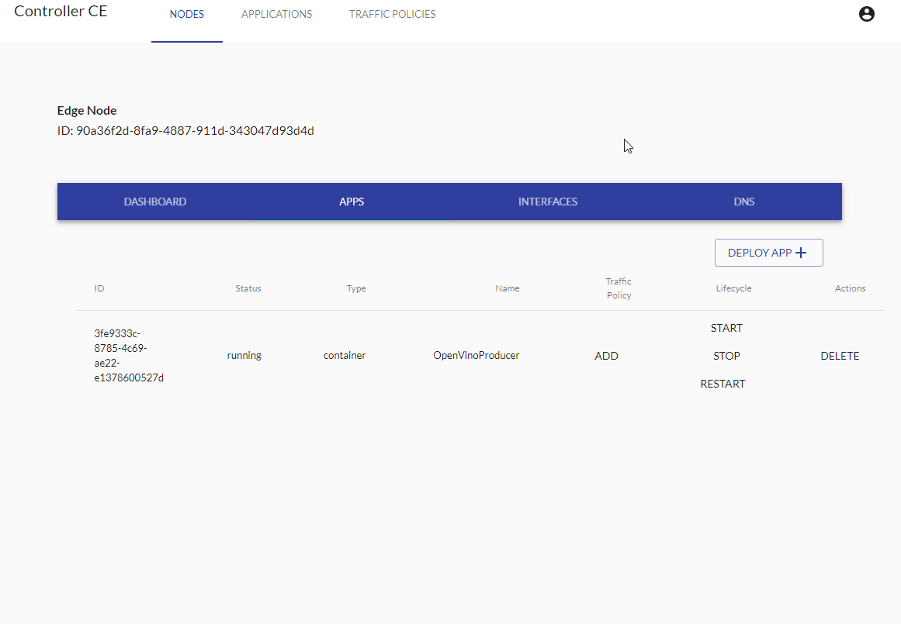

- You can "DELETE/RESTART" an application from this tab.

> Note the traffic policy if any must be removed before deleting the application.

## Onboarding OpenVINO applications

This chapter describes how to deploy OpenVINO applications on OpenNESS platform working in OnPremises mode.

### Prerequisites

* OpenNESS for OnPremises is fully installed and EdgeNode is enrolled to the EdgeController.
* The Docker images for the OpenVINO are available on HTTPS server and can be accessed by EdgeNode.
* A separate host used for generating traffic via Client Simulator is set up.
* The Edge Node host and traffic generating host are connected together point to point via unused physical network interfaces.
* A separate host or VM acts as gateway is used for NTS learning. It should be connected to the Edge Node via physical network interface as well.
* The Docker image for Client Simulator application is available on the traffic generating host.

### Setting up Network Interfaces

1. OpenVINO client host machine should have one of its physical interfaces connected to EdgeNode machine. IP address on this interface needs to be set to provide correct packets routing. Set it up using `ip` command:
   ```
   ip a a 192.168.10.10/24 dev <client_interface_name>
   ```

2. Gateway machine should have ip set as well on interface connected to the Edge Node:
    ```
    ip a a 192.168.10.9/24 dev <gateway_interface_name>
    ```

    Arps should be set this way:

    ```
    arp -s 192.168.10.11 f2:6c:29:2b:06:e6
    ```
    where `f2:6c:29:2b:06:e6` is MAC address of the interface bound to the OpenVINO consumer application container.

    Firewall on gateway machine should disabled or allowing rule for port 5001 should be applied.

3. Log in to the EdgeController UI. Move to Traffic Policies page and using the form add OpenVino policy according to the instruction below:
    * Priority: 99
    * Source:
      * IP Filter Address: 192.168.10.10 (OpenVINO client address)
      * IP Filter Mask: 24
    * Destination:
      * IP Filter Address: 192.168.10.11 (OpenVINO app address)
      * IP Filter Mask: 24
      * Protocol: All
    * Target action: accept

    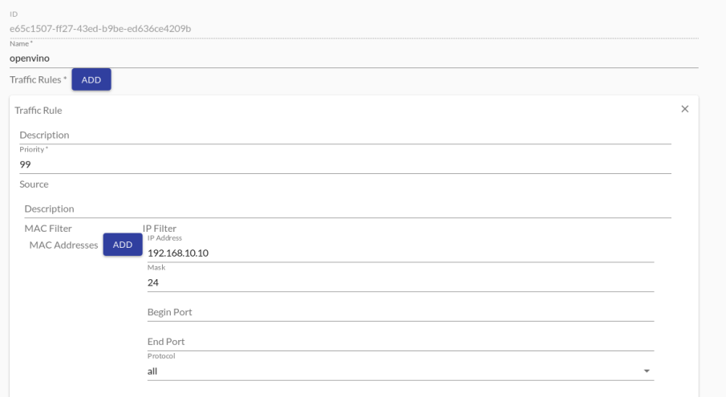

    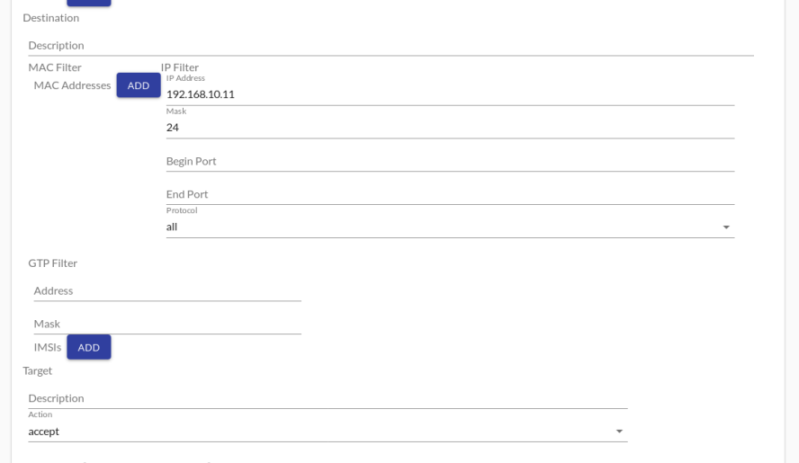

> Note: For creating Traffic Policy refer to [Instruction to create Traffic Policy and assign it to Interface](#instruction-to-create-traffic-policy-and-assign-it-to-interface)

4. Move to the EdgeNode interfaces setup. It should be available under button `Edit` next to the EdgeNode position on Dashboard page.
   * Find the port that is directly connected to the OpenVINO client machine port (eg. 0000:04:00.1)
     * Edit interface settings:

    

    Note: Fallback interface address is the one define below

    * Find the port that is directly connected to the gateway machine (eg. 0000:04:00.0)
      * Edit interface settings:

    

    Note: Fallback interface address is the one defined above

5. Commit those changes to start NTS
6. Create OpenVINO producer and consumer applications and deploy them on the node. When the applications has `Deployed` status start them with 10 seconds distance to let the producer to subscribe to the platform.
   
    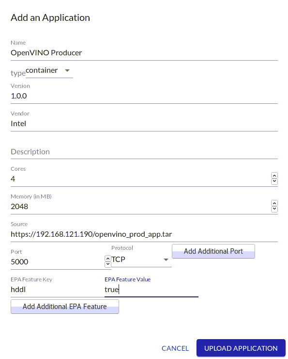

    Note: Fields `Port` and `Protocol` have no affect on the application

    Note: When creating a new application, there is an option to specify a key/value pair which defines an enhanced platform awareness (EPA) feature. If set, this key/value pair will be used to configure the feature when deploying an application to an edge node. For more information on the EPA features supported by OpenNESS, please see [Enhanced Platform Awareness](https://github.com/open-ness/specs/tree/master/doc/enhanced-platform-awareness).

    Note: Deployment of consumer application should be done by analogy

    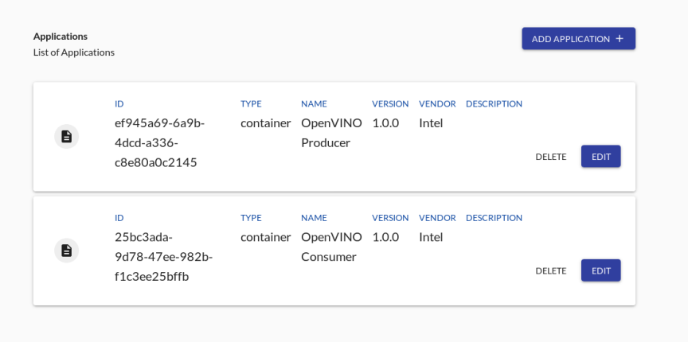

7. Add openvino traffic policy to consumer app
8. Log in to the consumer container and set IP address using
    ```
    docker exec -it <docker_id> /bin/bash
    ip link set dev vEth2 arp off
    ip a a 192.168.10.11/24 dev vEth2
    ip link set dev vEth2 up
    wget 192.168.10.10 -Y off 
    ```
9.  Modify `analytics.openness` entry in /etc/hosts with IP address set in step 1 (separate interface on OpenVINO client machine/VM)
10. Send ping from OpenVINO client platform to gateway using 192.168.10.9 IP address
11. On EdgeNode platform run `./edgenode/internal/nts/client/build/nes_client and check if NTS configured KNI interfaces correctly

    

### Starting traffic from Client Simulator

1. On the traffic generating host build the image for the [Client Simulator](#building-openvino-application-images), before building the image, in `tx_video.sh` in the directory containing the image Dockerfile edit the RTP endpoint with IP address of OpenVINO consumer application pod (to get IP address of the pod run: `kubectl exec -it openvino-cons-app ip a`)
2. Run the following from [edgeapps/applications/openvino/clientsim](https://github.com/open-ness/edgeapps/blob/master/applications/openvino/clientsim/run-docker.sh) to start the video traffic via the containerized Client Simulator. Graphical user environment is required to observe the results of the returning video stream.
   ```
   ./run_docker.sh
   ```

> **NOTE:** If a problem is encountered when running the `client-sim ` docker as `Could not initialize SDL - No available video device`. Disable SELinux through this command:
>  ```shell
>  $ setenforce 0
>  ```

> **NOTE:**  If the video window is not popping up and/or an error like `Could not find codec parameters for stream 0` appears, add a rule in firewall to permit ingress traffic on port `5001`:
>  ```shell
>  firewall-cmd --permanent --direct --add-rule ipv4 filter INPUT 0 -p udp --dport 5001 -j ACCEPT
>  firewall-cmd --reload
>  ```
