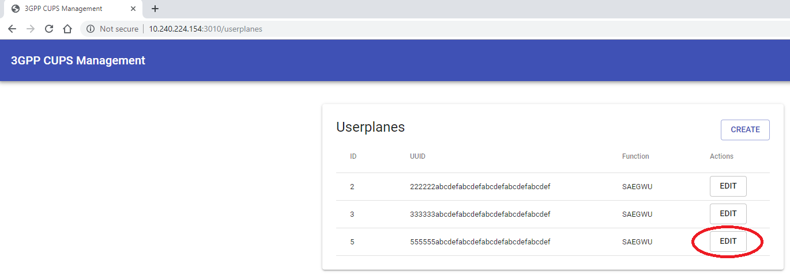
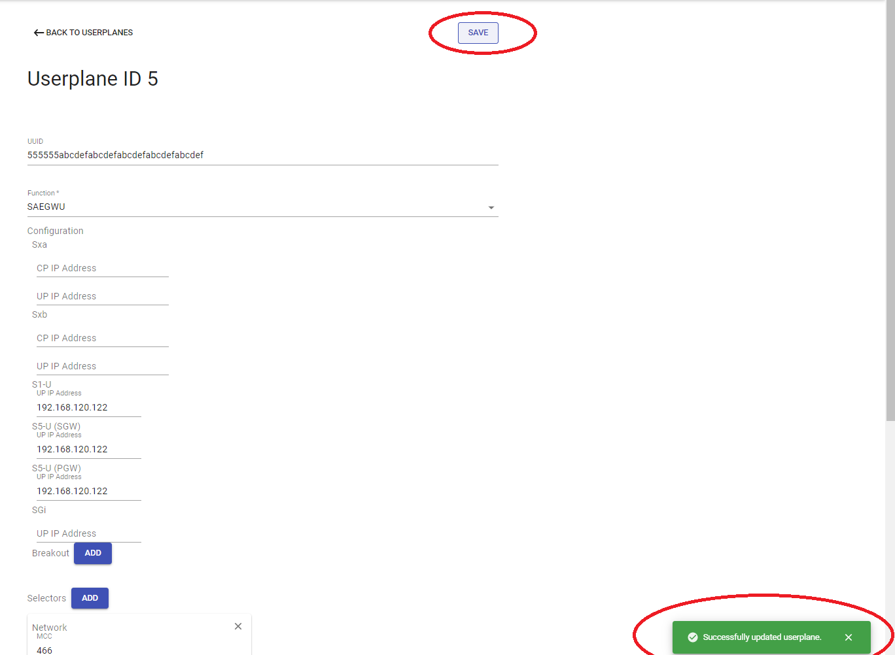
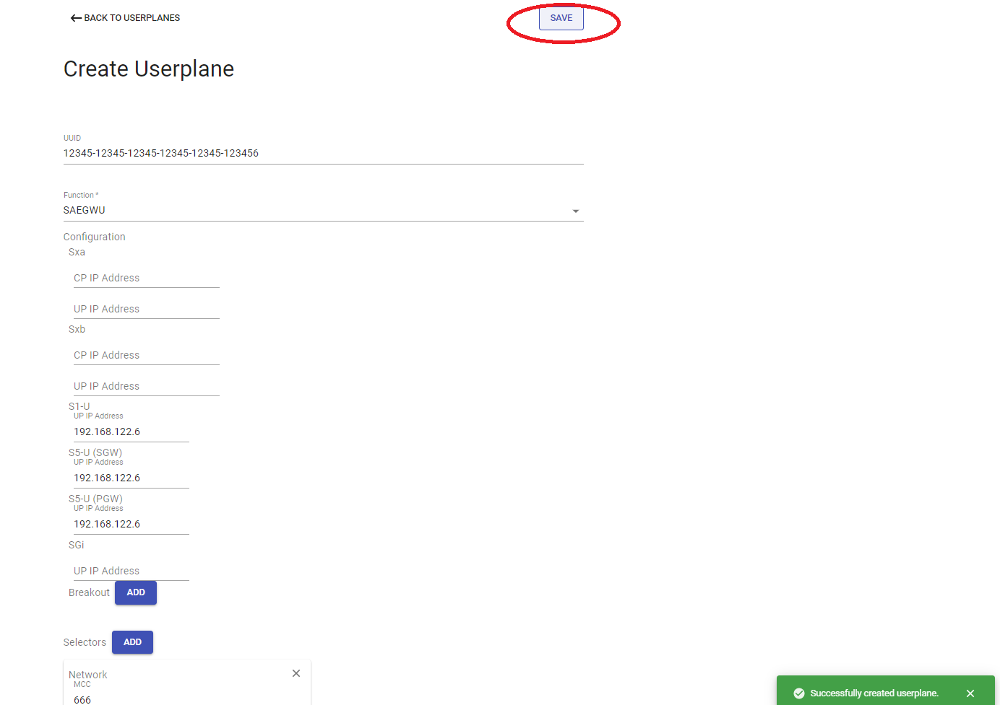
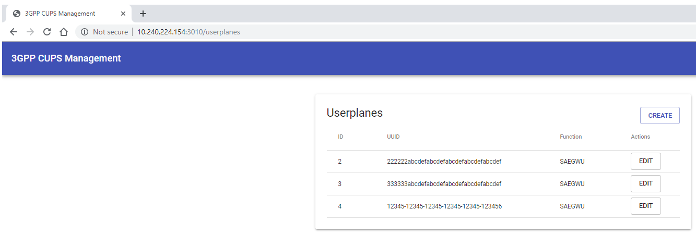

SPDX-License-Identifier: Apache-2.0     
Copyright © 2019 Intel Corporation  


- [4G/LTE Core Configuration using CNCA](#4glte-core-configuration-using-cnca)
  - [Configuring in Network Edge mode](#configuring-in-network-edge-mode)
    - [Sample YAML LTE CUPS userplane configuration](#sample-yaml-lte-cups-userplane-configuration)
  - [Configuring in On-Premises mode](#configuring-in-on-premises-mode)
    - [CUPS UI Prerequisites](#cups-ui-prerequisites)
    - [First time access to CUPS UI](#first-time-access-to-cups-ui)
      - [Prerequisites](#prerequisites)
      - [Steps to access UI](#steps-to-access-ui)
    - [Get User Plane specific information and Update](#get-user-plane-specific-information-and-update)
    - [Add a new user plane information to Core](#add-a-new-user-plane-information-to-core)
    - [Delete a user plane information from Core](#delete-a-user-plane-information-from-core)
- [5G NGC Configuration using CNCA](#5g-ngc-configuration-using-cnca)
  - [Configuring in Network Edge mode](#configuring-in-network-edge-mode-1)
    - [NGC OAM management](#ngc-oam-management)
    - [NGC AF management](#ngc-af-management)
      - [Sample YAML NGC AF subscription configuration](#sample-yaml-ngc-af-subscription-configuration)
  - [Configuring in Network Edge mode](#configuring-in-network-edge-mode-2)

# 4G/LTE Core Configuration using CNCA

## Configuring in Network Edge mode

In case of Network Edge mode, CNCA provides kubectl plugin to configure 4G/LTE Core network. Kubernetes adopts plugins concepts to extend its functionality. The `kube-cnca` plugin executes CNCA related functions within Kubernetes eco-system. The plugin performs remote callouts against LTE CUPS OAM agent.

Creation the LTE CUPS userplane is performed based on the configuration provided by the given YAML file. The YAML configuration should follow the provided sample YAML in [Sample YAML LTE CUPS userplane configuration](#sample-yaml-lte-cups-userplane-configuration) section. Use the `apply` command as below to post a userplane creation request onto AF:
```shell
kubectl cnca apply -f <config.yml>
```

When the userplane is created successfully, the `apply` command will return the userplane identifier `<userplane-id>`, which should be used in further correspondence with LTE CUPS OAM agent concerning this particular userplane. It is the responsibility of the user to retain the `<userplane-id>` as `kube-cnca` is a stateless function.

> NOTE: All active userplanes can be retrieved from AF through command `kubectl cnca get userplanes`.

To retrieve an existing userplane with a known userplane ID, use the below command:
```shell
kubectl cnca get userplane <userplane-id>
```

To retrieve all active userplanes at LTE CUPS OAM agent, execute this command:
```shell
kubectl cnca get userplanes
```

To modify an active userplane, use the `patch` command providing a YAML file with the subset of the configuration to be modified:
```shell
kubectl cnca patch <userplane-id> -f <config.yml>
```

To delete an active userplane, use the `delete` command as below:
```shell
kubectl cnca delete userplane <userplane-id>
```

### Sample YAML LTE CUPS userplane configuration

Similarly, the `kube-cnca` expects the YAML configuration as in the format below for the LTE CUPS-specific information. The file must contain the topmost configurations; `apiVersion`, `kind` and `policy`.

```yaml
apiVersion: v1
kind: lte
policy:
  id: '5'
  uuid: beauty
  function: SAEGWU
  config:
    s5u_pgw:
      up_ip_address: 192.168.120.122
    s1u:
      up_ip_address: 192.190.120.122
    s5u_sgw:
      up_ip_address: 192.168.120.122
  selectors:
  - id: select001
    network:
      mcc: '466'
      mnc: '92'
    uli:
      tai:
        tac: 51
    pdn:
      apns:
      - APN001
```


## Configuring in On-Premises mode

In case of On-Premise deployment mode, Core network can be configured through CNCA CUPS UI interface.

### CUPS UI Prerequisites

- Controller installation, configuration and run as root. Before build, need to setup controller env file for CUPS as below:
  
```
  REACT_APP_CONTROLLER_API=http://<controller_ip_address>>:8080
  REACT_APP_CUPS_API=http://<<oamagent_ip_address>>:8080
```

- Build the full controller stack including CUPS:

    `make build`

  - Start the full controller stack and CUPS UI:

    `make all-up`

    `make cups-ui-up`
  - Check whether controller CUPS UI already bring up by: 

```
    Docker ps 
    CONTAINER ID   IMAGE        COMMAND                  CREATED     STATUS      PORTS
    0eaaafc01013   cups:latest  "docker-entrypoint.s…"   8 days ago  Up 8 days   0.0.0.0:3010->80/tcp
    d732e5b93326   ui:latest    "docker-entrypoint.s…"   9 days ago  Up 9 days   0.0.0.0:3000->80/tcp
    8f055896c767   cce:latest   "/cce -adminPass cha…"   9 days ago  Up 9 days   0.0.0.0:6514->6514/tcp, 0.0.0.0:8080-8081->8080-8081/tcp, 0.0.0.0:8125->8125/tcp
    d02b5179990c   mysql:8.0    "docker-entrypoint.s…"   13 days ago Up 9 days   33060/tcp, 0.0.0.0:8083->3306/tcp  
```

- OAMAgent(EPC-OAM as called) and EPC Control plane installation, configuration and run as `root`.
  - OAMAgent plays as epc agent between OpenNESS controller and EPC. It will process CUPS API message (HTTP based) from controller, parse JSON payload in the HTTP request, and then convert it to message format that can be used by EPC. The reverse as similar. The architecture and more details can refer to README in epc-oam repo.
  - OAMAgent Installation and configuration can refer to README in epc-oam repo.
  - EPC installation and configuration.

### First time access to CUPS UI

#### Prerequisites

- REACT_APP_CUPS_API=http://<<oamagent_ip_address>>:8080 added to Controller's "~/controller/.env" file.
- Controller full stack including CUPS UI are running.
- Oamagent and EPC are running.
- Confirm connection between controller and oamagent (EPC). 

#### Steps to access UI

- Open any internet browser 
- Type in "http://<Controller_ip_address>:3010/userplanes" in address bar.
- This will display all the existing EPC user planes list as shown below:
  &nbsp;
  

### Get User Plane specific information and Update

- Identify the specific userplane using UUID to get additional information
- Click on **EDIT** as shown below
  &nbsp;  
  
  &nbsp;

- User plane information is displayed as shown below
  &nbsp; 
  
  &nbsp;

- Update parameters: any of the parameters _{S1-U , S5-U(SGW), S5-U(PGW), MNC,MCC, TAC, APN}_ as needed and then click on **Save**. 
  **NOTE** A pop up window will appear with “successfully updated userplane”
  &nbsp;
  
  &nbsp;

- After that, web page will automatically return back to the updated user plane list as shown below
  &nbsp;
  
  &nbsp;

### Add a new user plane information to Core

- Click on **CREATE** button.

- Filling uuid with 36 char string, select Function as “SAEGWU” and set values for parameters: S1-U , S5-U(SGW), S5-U(PGW), MNC,MCC, TAC and APN. And click on “Save” and pop up with “successfully created userplane” as below:
  &nbsp;
  
  &nbsp;

- After that, web page will automatically return back to the updated user plane list as shown below
  &nbsp; 
  
  &nbsp;

### Delete a user plane information from Core

- Find the user plane to delete using UUID and click **EDIT**

- Then web page will list the user plane information, and then click on **DELETE USERPLANE** with popup message with **successfully deleted userplane** as shown below
  &nbsp;  
  
  &nbsp;

- After that, web page will automatically return back to the updated user plane list as shown below
  &nbsp;
  
  &nbsp;

# 5G NGC Configuration using CNCA

## Configuring in Network Edge mode

In case of Network Edge mode, CNCA provides kubectl plugin to configure 5G Core network. Kubernetes adopts plugins concepts to extend its functionality. The `kube-cnca` plugin executes CNCA related functions within Kubernetes eco-system. The plugin performs remote callouts against NGC OAM, AF and LTE CUPS OAM agent.

Available management with `kube-cnca` against NGC OAM are:
1. Registration of AF service
2. Un-registration of AF service

Available management with `kube-cnca` against NGC Application Function (AF) are:
1. Creation of subscriptions
2. Deletion of subscriptions
3. Updating (patching) subscriptions

Available management with `kube-cnca` against LTE CUPS OAM agent are:
1. Creation of LTE CUPS userplanes
2. Deletion of LTE CUPS userplanes
3. Updating (patching) LTE CUPS userplanes

The `kube-cnca` plugin is installed automatically on the master node during the installation phase of the [OpenNESS Experience Kit](https://github.com/open-ness/specs/blob/master/doc/getting-started/openness-experience-kits.md).
In the following sections, a detailed explanation with examples is provided about CNCA management.

### NGC OAM management

To register AF service through NGC OAM function, execute:
```shell
kubectl cnca register --dnai=<DNAI> --dnn=<DNN> --tac=<TAC> --priDns=<pri-DNS> --secDns=<sec-DNS> --upfIp=<UPF-IP> --snssai=<SNSSAI>
```

The following parameters MUST be provided to the command in order to succeed:
1. Data Network Access Identifier (DNAI)
2. Data Network Name (DNN)
3. Primary DNS (priDns)
4. Secondary DNS (secDns)
5. UPF IP Address (upfIp)
6. Network Slice Identifier (SNSSAI)

Upon successful registration, subscriptions can be instantiated over with NGC AF. The `af-service-id` is returned by the `register` command to be used in further correspondence with NGC OAM & AF functions.

Un-registration of the AF service can be performed as in the command below:
```shell
kubectl cnca unregister <af-service-id>
```

### NGC AF management

Creation the AF subscription is performed based on the configuration provided by the given YAML file. The YAML configuration should follow the provided sample YAML in [Sample YAML NGC AF subscription configuration](#sample-yaml-ngc-af-subscription-configuration) section. Use the `apply` command as below to post a subscription creation request onto AF:
```shell
kubectl cnca apply -f <config.yml>
```

When the subscription is created successfully, the `apply` command will return the subscription identifier `<subscription-id>`, which should be used in further correspondence with AF concerning this particular subscription. It is the responsibility of the user to retain the `<subscription-id>` as `kube-cnca` is a stateless function.

> NOTE: All active subscriptions can be retrieved from AF through command `kubectl cnca get subscriptions`.

To retrieve an existing subscription with a known subscription ID, use the below command:
```shell
kubectl cnca get subscription <subscription-id>
```

To retrieve all active subscriptions at AF, execute this command:
```shell
kubectl cnca get subscriptions
```

To modify an active subscription, use the `patch` command providing a YAML file with the subset of the configuration to be modified:
```shell
kubectl cnca patch <subscription-id> -f <config.yml>
```

To delete an active subscription, use the `delete` command as below:
```shell
kubectl cnca delete subscription <subscription-id>
```

#### Sample YAML NGC AF subscription configuration

The `kube-cnca` expects the YAML configuration as in the format below. The file must contain the topmost configurations; `apiVersion`, `kind` and `policy`. The configuration `policy` retains the NGC AF-specific subscription information.

```yaml
apiVersion: v1
kind: ngc
policy:
  afServiceId: 'afService001'
  afAppId: app001
  afTransId: ''
  appReloInd: false
  dnn: edgeLocation001
  snssai:
    sst: 0
    sd: default
  anyUeInd: false
  gpsi: ''
  ipv4Addr: 127.0.0.1
  ipv6Addr: ''
  macAddr: ''
  requestTestNotification: true
  websockNotifConfig:
    websocketUri: ''
    requestWebsocketUri: true
  trafficRoutes:
  - dnai: edgeLocation001
    routeInfo:
      ipv4Addr: ''
      ipv6Addr: ''
    routeProfId: default
```

## Configuring in Network Edge mode

**TBA**
