```text
SPDX-License-Identifier: Apache-2.0
Copyright (c) 2020 Intel Corporation
```

# OpenNESS Architecture and Solution overview
- [OpenNESS Architecture and Solution overview](#openness-architecture-and-solution-overview)
  - [Introduction](#introduction)
    - [Key Terminologies defining OpenNESS](#key-terminologies-defining-openness)
  - [Overview](#overview)
    - [OpenNESS Controller Community Edition](#openness-controller-community-edition)
      - [Details of Edge Controller Microservices functionality in Native deployment mode](#details-of-edge-controller-microservices-functionality-in-native-deployment-mode)
      - [Details of Edge Controller Microservices functionality in Infrastructure deployment mode](#details-of-edge-controller-microservices-functionality-in-infrastructure-deployment-mode)
      - [Edge Application Onboarding](#edge-application-onboarding)
        - [Application onboarding in OpenNESS Native deployment mode](#application-onboarding-in-openness-native-deployment-mode)
        - [Application onboarding in OpenNESS Infrastructure deployment mode](#application-onboarding-in-openness-infrastructure-deployment-mode)
    - [OpenNESS Edge Node](#openness-edge-node)
      - [Edge Node Microservices](#edge-node-microservices)
        - [Edge Node Microservices OpenNESS Native deployment mode](#edge-node-microservices-openness-native-deployment-mode)
        - [Edge Node Microservices OpenNESS Infrastructure deployment mode](#edge-node-microservices-openness-infrastructure-deployment-mode)
      - [Edge Application API support](#edge-application-api-support)
      - [Edge Compute Applications: Native on the Edge Node](#edge-compute-applications-native-on-the-edge-node)
      - [Edge Compute Applications: Local Breakout](#edge-compute-applications-local-breakout)
    - [Multi Access Support](#multi-access-support)
  - [Deployment Scenarios](#deployment-scenarios)
    - [On-Premises Edge Deployment Scenario](#on-premises-edge-deployment-scenario)
    - [Network Edge Deployment Scenario](#network-edge-deployment-scenario)
  - [OpenNESS Support for Deployment flavors](#openness-support-for-deployment-flavors)
    - [RAN node flavor](#ran-node-flavor)
    - [Core node flavor](#core-node-flavor)
    - [Application node flavor](#application-node-flavor)
    - [OnPremises application node flavor](#onpremises-application-node-flavor)
    - [OnPremises all-in-one node - CERA](#onpremises-all-in-one-node---cera)
  - [Enhanced Platform Awareness through OpenNESS](#enhanced-platform-awareness-through-openness)
  - [OpenNESS Edge Node Applications](#openness-edge-node-applications)
    - [Producer Application](#producer-application)
    - [Consumer Application](#consumer-application)
    - [Example of Producer and Consumer Applications](#example-of-producer-and-consumer-applications)
    - [Dynamic CPU and VPU usage](#dynamic-cpu-and-vpu-usage)
    - [Cloud Adapter Edge compute Application](#cloud-adapter-edge-compute-application)
  - [OpenNESS Microservices and APIs](#openness-microservices-and-apis)
    - [Edge Application APIs](#edge-application-apis)
    - [Edge Application Authentication APIs](#edge-application-authentication-apis)
    - [Edge Lifecycle Management APIs](#edge-lifecycle-management-apis)
    - [Edge Virtualization Infrastructure APIs](#edge-virtualization-infrastructure-apis)
    - [Core Network Configuration APIs for edge compute](#core-network-configuration-apis-for-edge-compute)
    - [Core Network Configuration API for 5G](#core-network-configuration-api-for-5g)
    - [Core Network Configuration API for 4G CUPS](#core-network-configuration-api-for-4g-cups)
    - [OpenNESS Controller APIs](#openness-controller-apis)
  - [OpenNESS OS environment](#openness-os-environment)
  - [OpenNESS steps to get started](#openness-steps-to-get-started)
  - [OpenNESS Repository Structure](#openness-repository-structure)
  - [Other References](#other-references)
  - [List of Abbreviations](#list-of-abbreviations)

## Introduction
OpenNESS is an open source software toolkit to enable easy orchestration of edge services and network functions across diverse network platform and access technologies in multi-cloud environments. It is inspired by the edge computing architecture defined by the ETSI Multi-access Edge Computing standards (e.g., [ETSI_MEC 003]), as well as the 5G network architecture ([3GPP_23501]).
 
It leverages major industry edge orchestration frameworks, such as Kubernetes and OpenStack, to implement a cloud-native architecture that is multi-platform, multi-access, and multi-cloud. It goes beyond these frameworks, however, by providing the ability for applications to publish their presence and capabilities on the platform, and for other applications to subscribe to those services. Services may be very diverse, from providing location and radio network information, to operating a computer vision system that recognize pedestrians and cars, and forwards metadata from those objects to downstream traffic safety applications.
 
OpenNESS is access network agnostic, as it provides an architecture that interoperates with LTE, 5G, WiFi, and wired networks. In edge computing, dataplane flows must be routed to Edge Nodes with regard to physical location (e.g., proximity to the endpoint, system load on the Edge Node, special hardware requirements). OpenNESS provides APIs that allow network orchestrators and edge computing controllers to configure routing policies in a uniform manner.
 
Because it is an open source platform, OpenNESS enables operators, ISVs, and OSVs to innovate with new technologies and services. Field trials may be run with platforms implemented via OpenNESS, or Microservices and functionality from the OpenNESS platform may be imported into existing third-party products.

### Key Terminologies defining OpenNESS 
- **Orchestration**: Orchestration in the context of OpenNESS refers to exposing northbound APIs for Deploying, Managing, Automating the Edge compute cluster and Applications that run on the cluster. E.g. OpenNESS northbound APIs that can be used by Orchestrators like ONAP for managing the OpenNESS edge solution.  
- **Edge Services**: Edge Services in the context of OpenNESS refers to the Applications that service end-user traffic and Applications that provide services to other Edge compute Applications. E.g. CDN is an Edge application that services end-user traffic whereas Transcoding services is an application that provides service to CDN application.  
- **Network Functions**: Network Functions in the context of OpenNESS refers to typical Container Networking Functions (CNFs) that enable edge cloud deployment in Wireless access, Wireline and WiFi deployments. E.g. 5G UPF is as CNF supports steering application traffic towards edge cloud applications, gNodeB that serves User equipment (UE) in 5G NR millimeter wave or Sub6 GHz deployments etc. 
- **Network platform**: Network platform in the context of OpenNESS refers to nodes that are deployed in Network or On-Premises edge compute processing. These are typically COTS platforms which can host both Applications and VNFs. 
- **Access technologies**: Access technologies in the context of OpenNESS refers to various types of traffic that OpenNESS solution can be handled. They include 5G, LTE (GTP/IP), Wireline (IP) and Wifi (IP).  
- **Multi Cloud**: Multi Cloud in the context of OpenNESS refers to support in OpenNESS to host multiple Public or Private cloud application on the same node or in the OpenNESS compute cluster. These cloud applications can come from e.g. Amazon AWS Greengrass, Baidu cloud etc. 
  
## Overview
An OpenNESS subsystem consists of one or more OpenNESS Edge Nodes, and a Controller Node that hosts OpenNESS Controller microservices.   

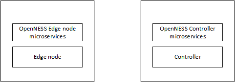

_Figure - OpenNESS overview_

The Edge Node hosts a set of OpenNESS Microservices, Edge compute applications and network functions  
- OpenNESS Edge Node Microservices address the following functionality: 
  - Manage application lifecycles 
  - Enforce the DNS and Network policy 
  - Steer dataplane traffic to Edge Node applications 
  - Steering dataplane Traffic to local breakout (LBO) hosts that may be attached to the Edge Node
  - Support microservices or enhancements that expose Platform capabilities a.k.a Enhanced Platform Awareness (EPA) to the Edge compute applications and network functions
  
The Controller depending on the deployment either operates the Edge Nodes by invoking the Edge Node APIs or uses the exisitng orchestrator to manage the Edge Node. The controller  exposes APIs to allow network orchestrators to operate the OpenNESS subsystem. 

OpenNESS is intended for customers like:
- Operators to conduct lab/field trials of edge compute in Network edge and On-Premises Edge, 
- ISVs or OSVs to develop edge compute infrastructure solutions that take advantage of the COTS Architecture 
- Application developers who intend to develop applications for the edge, port the applications from public cloud to edge to take advantage of being closer to user. 

OpenNESS microservices could also be integrated in to pre-existing cloud platform hosting edge services.

OpenNESS controller (Community edition) manages the OpenNESS edge compute nodes leveraging the exisitng resource orchestrator. 


_Figure - OpenNESS Architecture_

OpenNESS reference edge stack combines the cloud-native and NFV infrastructure optimizations for Virtual machine and Container cloud on COTS Architecture (CPU,Memory,IO and Acceleration) from various open-source projects with essential amount of Edge compute specific APIs and network abstraction on to provide a unique and one-stop-shop development solution for edge compute. 

The architecture of the OpenNESS Edge compute reference stack is described in greater detail in following subsections of this document.

### OpenNESS Controller Community Edition
OpenNESS Controller Community Edition consists set of microservices that enables existing Edge compute Cloud orchestration and application lifecycle management. These microservices are Web-UI, Controller API back-end and Database. 

When the OpenNESS Controller interfaces to an existing orchestrator like Kubernetes, it does not duplicate the implementation of lifecycle management and traffic policy APIs of the Containers but it uses the existing Kubernetes APIs to execute lifecycle management and traffic policy tasks. 

Hence OpenNESS Controller deployment is described in these two modes: 
-  <b>OpenNESS Native deployment</b>: OpenNESS deployed using controller which interfaces NFV infrastructure directly (libvirt/docker runtime)
-  <b>OpenNESS Infrastructure deployment</b>: OpenNESS deployed using Kubernetes as an orchestrator 

#### Details of Edge Controller Microservices functionality in Native deployment mode 
- **Web UI front end**: Reference HTML5 based web front end for Administrator management of Edge Nodes.
- **User account management**: Create administrator and user accounts for Edge Node management. 
- **Edge compute application catalogue**: Provide capability of adding applications to Controller catalogue. 
- **Core Network Configuration**: Configure the access network (e.g., LTE/CUPS, 5G) control plane. 
- **Edge Node Lifecycle Management**: support the Edge Node throughout its deployment lifecycle: 
  - Authentication and enrollment of Edge Nodes 
  - Configuration of interfaces and microservices on Edge Nodes 
  - Configuration of traffic policy for the interfaces including Local Breakout (LBO) interface 
- **Edge Application Lifecycle Management**: Support applications through their lifecycle: 
  - Expose the silicon micro architecture features on CPU, HW Accelerator, Network interface etc. through  Enhanced Platform Awareness (EPA) framework to the applications for lower overhead and high performance execution. 
  - Deploy edge compute applications from the image repository 
  - Configure the Edge compute application specific Traffic policy 
  - Configure the Edge compute application specific DNS policy 
- **Node Feature Discovery (NFD)**: Contains two microservices. One on the controller (master) and one on the edge nodes (worker). NFD workers gets the hardware and software features on the edge node and the information is passed on to the NFD Master on the controller node. This information can be used by the user to deploy the applications to the edge node which meets the specific resource requirement. This ensures  reliable performance.
- **Enhanced Platform Awareness**: is a subsystem of the application life cycle management that enables users to provide key hardware or software features that needs to be made available to the applications when deployed on the edge node. The user is presented with a key:Value pair to choose from the supported EPA features. NFD when combined with EPA provides a powerful mechanism for achieving application performance reliability. 
- **Edge virtualization infrastructure management**: Use underlying virtualization infrastructure, whether directly via libvirt or Docker, or indirectly via Kubernetes, to manage the Edge Node platform and applications. 
- **Telemetry**: Get basic edge compute microservices telemetry from connected Edge Nodes.

The Controller microservices make extensive use of the Go programming language and its runtime libraries.

#### Details of Edge Controller Microservices functionality in Infrastructure deployment mode
- **Core Network Configuration**: Configure the access network (e.g., LTE/CUPS, 5G) control plane. 
- **Telemetry**: Get basic edge compute microservices telemetry from connected Edge Nodes.
- **Microservices and Enhancements for K8s master**: Set of microservice as daemon set deployed on Master to enable deployment. E.g. NFD (master), SRI-OV device plugin, etc. 

OpenNESS when deployed using Kubernetes supports key features that expose the silicon micro architecture features of the platform to the applications and network functions  to achieve better and reliable performance. This will be described in the Enhanced Platform Awareness (EPA) section later in the document. 

The OpenNESS Controller addresses the essential functionalities of a multi-access edge orchestrator and MEC Platform manger as defined in the ETSI MEC Multi-access Edge Computing (MEC): Framework and Reference Architecture. In the rest of this document, “OpenNESS Controller Community Edition” will be referred to as “Controller” or “OpenNESS Controller”.

#### Edge Application Onboarding

Steps and components involved in Edge Application Onboarding is described in two modes
-  OpenNESS Native deployment
-  OpenNESS Infrastructure deployment

##### Application onboarding in OpenNESS Native deployment mode
OpenNESS Controller is used to onboard an application to the OpenNESS Edge Node. OpenNESS support applications that can run in a docker container or Virtual machine. Docker image tar.gz and VM image qcow2 are supported. The image source link needs to be over HTTPS. The image repository can be an external image server or one that can be deployed on the controller. The figure below shows the steps involved in application onboarding.  

 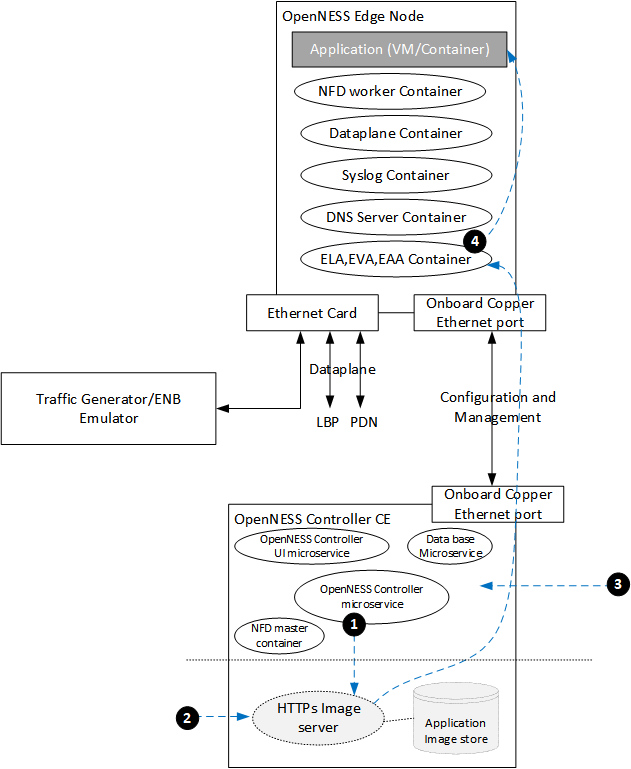

 _Figure - Edge Application Onboarding Native deployment_

1. User sets up the HTTPS based Application image server. The image source needs to support HTTPS download. Edge Node trusts public CAs and the one from the controller. 
2. User uploads the application image (container tar.gz image or VM qcow2) to the HTTPs server and ensures uploaded image is available for download over HTTPS.
3. User uses NFD to identify the edge node that supports the required EPA. 
4. User initiates the Application deploy step using the Controller UI to the node that provides the required EPA for the application. This step initiates the download of the image from the HTTPS server to the Edge Node. After this step EVA registers the Application image. 
5. User starts the Application, which kick starts the Container/Pod/VM. 

##### Application onboarding in OpenNESS Infrastructure deployment mode
OpenNESS users need to use the Kubernetes Master to onboard and application to the OpenNESS Edge Node. OpenNESS support applications that can run in a docker container (Docker image tar.gz). The image source can be a docker registry or HTTPS image repository. The image repository can be an external image server or one that can be deployed on the controller. The figure below shows the steps involved in application onboarding.  

 

 _Figure - Edge Application Onboarding Infrastructure deployment_

1. User sets up the HTTPS based Application image server / Docker Registry where application container image is stored. 
2. User uploads the application image (container tar.gz) to the HTTPs server. User downloads the application container image to the Edge Node.  
3. User initiates the Application deploy step using Kubernetes (kubectl). In this step user uses all the Kubernetes enhancements for EPA using NFD to deploy the application pod on the right node. 

### OpenNESS Edge Node 

#### Edge Node Microservices

OpenNESS Edge Node hosts a set of microservices to enable Edge compute deployment. The type of OpenNESS microservices deployed on the Edge Node depends on the type of deployment - OpenNESS Infrastructure deployment or OpenNESS Native deployment. This is similar to OpenNESS controller deployment types described above.

##### Edge Node Microservices OpenNESS Native deployment mode
Microservices deployed on the Edge Node in this mode include ELA, EVA, EAA, Syslog, DNS Server and OVN/OVS-DPDK dataplane or optionally NTS Dataplane. 

 

 _Figure - Edge Node microservices_

OpenNESS Edge Node microservices implement functionality to enable execution of edge compute applications natively on the Edge Node or forward the user traffic to applications running on platforms connected to the Edge Node on a Local Breakout. 

Details of Edge Node Microservices functionality: 

- **Edge Node Enrollment**: During the initial boot, connect to the designated OpenNESS Controller and request to enroll. This functionality is implemented in the ELA (Edge Lifecycle Agent) microservice. As part of enrolling, the Edge Node is provided a TLS based certificate, which is used for further API communication. Figure below depicts this behavior. ELA is implemented using Go lang.
 
 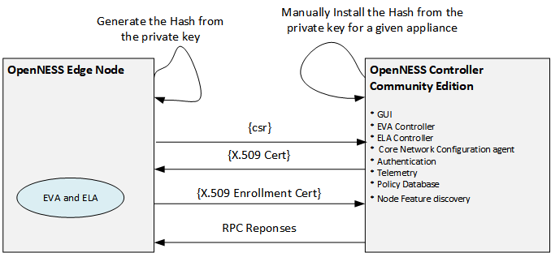
 
 _Figure - Edge Node Authentication and enrollment_

- **Edge Node interface configuration**: During initial bootup, the Edge Node sends a map of the existing Network interfaces to the Controller to be configured as Upstream, Downstream or on local breakout. This functionality is implemented in the ELA microservice. 
- **DNS service**: Support DNS resolution and forwarding services for the application deployed on the edge compute. DNS server is implemented based on Go DNS library. DNS service supports resolving DNS requests from User Equipment (UE) and Applications on the edge cloud.  
- **Edge Node Virtualization infrastructure**: Receive commands from the controller/NFV infrastructure managers to start and stop Applications. This functionality is implemented in the EVA (Edge virtualization Agent) microservice and is implemented in Go lang. 
- **Edge application traffic policy**: Interface to set traffic policy for application deployed on the Edge Node. This functionality is implemented in the EDA (Edge Dataplane Agent) microservice and is implemented in Go lang. 
- **Dataplane Service**: Steers traffic towards applications running on the Edge Node or the Local Break-out Port.   
 
   <b>NTS</b>
  - NTS (Network Transport Service) is the primary dataplane supported  
  - Its mainly developed to support S1u deployments 
  - When NTS is used as Dataplane OVS-DPDK can be used as inter-app service. 
  - Utilizing the Data Plane NTS (Network Transport Service), which runs on every Edge Node. It is implemented in C lang using DPDK for high performance IO. This is the recommended dataplane when incoming and outgoing flows are a mix of pure IP + S1u (GTPu). 
    - Provide Reference ACL based Application specific packet tuple filtering 
    - Provide reference GTPU base packet learning for S1 deployment 
    - Provide reference Simultaneous IP and S1 deployment 
    - Provide Reference API for REST/grpc to C API 
    - Future enhancement of UE based traffic steering for authentication
    - Reference implementation which does not depend on EPC implementation 
    - Reference Packet forwarding decision independent of IO
    - Implement KNI based interface to Edge applications running as Containers/POD 
    - Implement DPDK vHost user based interface to Edge applications running as Virtual Machine 
    - Implement Scatter and Gather in upstream and downstream 
    - Dedicated interface created for dataplane based on vhost-user for VM, dpdk-kni for Containers
    - Container or VM default Interface can be used for Inter-App, management and Internet access from application 
    - Dedicated OVS-DPDK interface for inter-apps communication can be created in case of On-Premises deployment. 
  
<b>OVN/OVS-DPDK</b>
  - The secondary dataplane that is supported in native mode is OVN/OVS-DPDK. 
  - For non-S1u deployments this should be the dataplane of choice 
  - OVN manages the IP addresses allocated to the applications 
  - In this mode both north-south and east-west traffic is supported by OVS-DPDK.   
  - vEth pair is used as interface for container and vitrio for VMs 

>Note: In the future releases OVN/OVS-DPDK will be primary dataplane supported. 

- **Application Authentication**: Ability to authenticate an Edge compute application deployed from the Controller so that application can avail/call Edge Application APIs. Only applications that intend to call the Edge Application APIs need to be authenticated. TLS certificate based Authentication is implemented. 


_Figure - OpenNESS Edge Compute Application Authentication_

##### Edge Node Microservices OpenNESS Infrastructure deployment mode
EAA, EIS and DNS are OpenNESS microservices  deployed in this mode on the Edge Node. The rest of the functionality is achieved by leveraging the Kubernetes components. 

 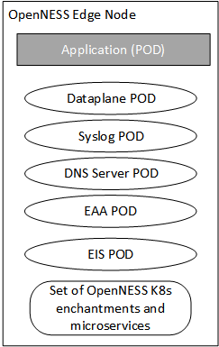

 _Figure - Edge Node microservices_

OpenNESS Edge Node microservices implement functionality to enable execution of edge compute applications natively on the Edge Node or forward the user traffic to applications running on platforms connected to the Edge Node on a Local Breakout. 

Details of Edge Node Microservices functionality: 

- **Edge Node Enrollment**: Edge Node enrollment is supported using K8s cluster join. 
- **Edge Node interface configuration**: Edge Node interface configuration is implemented using EIS (Edge Interface Service) Daemonset and it is controlled by K8s/kubectl.  
- **DNS service**: Support DNS resolution and forwarding services for the application deployed on the edge compute. DNS server is implemented based on Go DNS library. DNS service supports resolving DNS requests from User Equipment (UE) and Applications on the edge cloud.  
- **Dataplane Service**: Steers traffic towards applications running on the Edge Node or the Local Break-out Port. 
  - Using OVN/OVS as Dataplane - recommended dataplane when incoming and outgoing flows are based on pure IP. 
    - Dataplane is supported in both OVS only or OVS-DPDK mode for higher performance. 
    - Implemented using [kube-ovn](https://github.com/alauda/kube-ovn)
    - Provides IP 5-tuple based flow filtering and forwarding
    - Same Interface can be used for Inter-App, management, Internet and Dataplane interface
- **Application Authentication**: Ability to authenticate Edge compute application deployed from the Controller so that the application can avail/call of Edge Application APIs. Only applications that intend to call the Edge Application APIs need to be authenticated. TLS certificate based Authentication is implemented. 
- **Microservices and Enhancements for node**: Set of microservice as daemon/replica set deployed on node to enable Cloud Native deployment. E.g. NFD (worker), multus, SRI-OV device plugin, etc. 

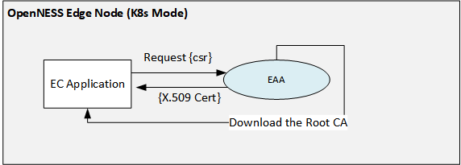

_Figure - OpenNESS Edge Compute Application Authentication_

#### Edge Application API support

Before looking at the APIs that are exposed to the Edge Applications, let's have a look at two types of applications that can be deployed on the Edge Node. 
- **Producer Application**: OpenNESS Producer application is an edge compute application that provides services to other applications running on the edge compute platform. E.g. Location Services, Mapping Services, Transcoding Services, etc. 
- **Consumer Application**: OpenNESS Consumer application is an edge compute application that serves end users traffic directly. E.g. CDN App, Augmented Reality App, VR Application, Infotainment Application, etc. Pre-existing cloud applications that do not intend to call the EAA APIs but would like to serve the users (without any changes to the implementation) on the edge also fall into this category. 

API endpoint for edge applications is implemented in the EAA (Edge Application Agent) microservice and is implemented in Go lang. APIs are classified into:

| Edge Application API                     | Description                                                                                                                                                                                                                                                 | Example                                                                                                         |
|------------------------------------------|-------------------------------------------------------------------------------------------------------------------------------------------------------------------------------------------------------------------------------------------------------------|-----------------------------------------------------------------------------------------------------------------|
| **Edge Service Activation/Deactivation** | This API endpoint enables a Producer App on the Edge Node to register and activate on the Edge Node\. After this API execution the Producer App will be discoverable to Consumer Apps on the Edge Node\.                                                    | Location Service Producer app will call this API first after being deployed from the controller\.               |
| **Edge Service Discovery**               | This API Endpoint enables a Consumer application to discover all the active Producer Applications on the Edge Node\.                                                                                                                                          | A CDN App will be able to discover Location Service Application on the Edge Node\.                              |
| **Edge Service Subscription/Unsubscription** | This API Endpoint enables a Consumer application to subscribe to Producer application service and notification updates\.                                                                                                                                      | A CDN application can subscribe to the Location Service application and Notification update from the service\.  |
| **Edge Service Notification update**     | This is a Web socket connection that needs to be created by a Consumer Application which intends to subscribe to services from Producer Applications\. This WebSocket will be used for push\-notification when there is update from the Producer Application\.  | Location update is sent as Push Notification update to the CDN Application\.                                        |
| **Edge Service data update**             | This API endpoint enables a Producer Application to publish the data to the Edge Node when it has an update to its service\.                                                                                                                                   |  Location Service Producer App publishes Location update of a user to the Edge Node\.                           |
| **Edge Service list subscription**       | This API endpoint allows a Consumer Application to get the list of Producer Application services it has availed of\.                                                                                                                                             | CDN Application can call this API to check if it has subscribed to Location and Transcoding services\.          |

- **Edge Node telemetry**: Utilizing the rsyslog, all OpenNESS microservices send telemetry updates which includes the logging and packet forwarding statistics data from the dataplane. This is also the mechanism that is encouraged for OpenNESS users for Debugging and Troubleshooting. 

**OpenNESS Edge Node Resource usage**: 
- All non-critical/non-realtime microservices on the OpenNESS Edge Node execute on OS core typically Core 0.
- Dataplane NTS and DPDK PMD thread requires a dedicated core/thread for high performance.
- Dataplane OVS-DPDK requires dedicated core/thread for high performance.
  - DPDK library is used for the dataplane implementation 1G/2M hugepages support is required on the host. 

#### Edge Compute Applications: Native on the Edge Node
OpenNESS supports execution of an application on the Edge Node as a VM/Container instance. This is typically the case when customers are looking for high density edge compute platforms with the expectation of resource pooling across Edge Applications (in some cases Edge Applications co-existing with VNFs). OpenNESS supports both native edge compute apps and IOT Gateways to run as edge compute applications co-existing on the same platform with VNFs and share platform resources. 

#### Edge Compute Applications: Local Breakout
OpenNESS supports steering traffic to applications that are already running on the customer IT infrastructure. Such applications are referred to as Applications on LBP (Local Breakout Port). In the diagram below, the Edge Node data plane is connected to a Local Breakout which is terminated on a Switch. There is an Enterprise Application server that is running enterprise apps connected to the TOR. Users can use OpenNESS Controller to configure certain users application traffic to be steered to the Enterprise Application servers. This deployment removes restriction of creating Edge Compute Apps from scratch and reuses the existing Enterprise Application software and Hardware infrastructure. 

Figure below shows a possible deployment of LBP servers, in this case a rack of Enterprise App Servers routed through a Top-of-Rack (TOR) switch. 


_Figure - OpenNESS Native and LBP Applications_

OpenNESS supports traffic steering to applications already running on a customer IT infrastructure. The infrastructure is attached to the Edge Node via a Local Breakout Port (LBP), and traffic steering rules are defined to direct traffic to the LBP, rather than to an edge application running on the Edge Node.

### Multi Access Support

OpenNESS may be deployed on 5G, LTE or IP (wireless or wireline) networks. The networking abstraction provided by the Edge Node Dataplane, network policy configuration and the Core Network Configuration Agent (CNCA) abstracts the protocol, access technology and access technology configuration differences such that edge applications see standard IP traffic as though they are deployed in the cloud. 
 
OpenNESS supports multiple deployment options on an 5G Stand alone and LTE cellular network, as shown in Figure below. 

- <b>5G Standalone edge cloud deployment</b> OpenNESS supports deployment of the Edge cloud as per the [3GPP_29.522 Rel v15.3]. In this mode, OpenNESS uses the 3GPP defined Service Based Architecture (SBA) REST APIs. The APIs use the "traffic influence" feature of the Application Function (AF) for Local Data Network (Edge cloud) processing. 

- <b>Edge cloud deployment on CUPS or SGi</b> The Edge Node may be attached to the SGi interface of an EPC. Traffic from the EPC arrives as IP traffic, and is steered as appropriate to edge applications. EPCs may combine the control or user plane, or they may follow the Control-User Plane Separation (CUPS) architecture of [3GPP_23214], which provides for greater flexibility in routing data plane traffic through the LTE network. When EPC CUPS is deployed OpenNESS supports reference Core Network Configuration for APN based traffic steering for local edge cloud. 

- <b>S1-U deployment in On-Premises Private LTE deployment </b>: Following [3GPP_23401], the Edge Node may be deployed on the S1 interface from an eNB. In this mode, traffic is intercepted by the Edge Node dataplane, which either redirects the traffic to edge applications or passes it through an upstream EPC. In this option, arriving traffic is encapsulated in a GTP tunnel; the dataplane handles decapsulation/encapsulation as required.

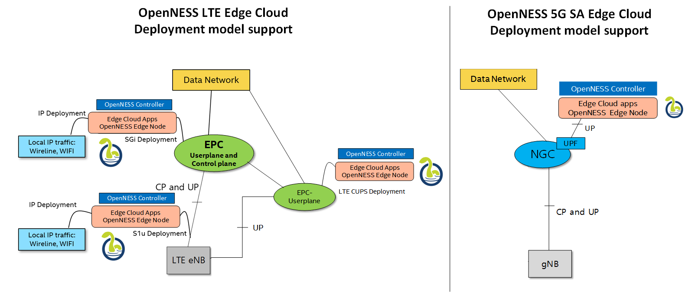

_Figure - Edge Node Deployment with Access Networks_

## Deployment Scenarios
The edge computing industry has devoted much effort to defining a taxonomy of edge computing deployment scenarios, based on physical location (e.g., street fixtures, central offices, data centers), logical location (e.g., on premises, far edge, near edge), and physical properties (e.g., end-to-end transmission latency). OpenNESS, as an open source platform, has taken the strategy of categorizing major characteristics of these deployment scenarios in terms of their impact on the design of a particular solution. Two primary deployment scenarios, On-Premises” and “Network Edge”, have been identified, and are described in the following sub-sections.

These scenarios are not strict; an enterprise customer may have a special case in which a network edge deployment is appropriate, and a carrier may have a special case in which an on-premises deployment is appropriate.

### On-Premises Edge Deployment Scenario
The on-premises edge deployment scenario is depicted in the Figure below. In this scenario, Edge Nodes are located in a customer premises, which may be an office, factory, stadium, or other single-tenant facility. It is also typical for using Private LTE in such deployments. 
 
An on-premises deployment is likely to have a single tenant, and is likely to be subordinate to an enterprise-wide IT infrastructure. It is likely to have strict latency requirements or environmental requirements that require an Edge Node to be located very close to the endpoints that it serves. In this environment, it may not be necessary to add another level of infrastructure management; the OpenNESS Controller will have the capacity to manage its Edge Nodes directly, via libvirt or Docker. Such OnPrem deployments are supported through OpenNESS Native deployment mode.
 
The OpenNESS Controller may be hosted locally, or be hosted in an enterprise or public cloud to manage Edge Nodes in multiple physical locations.

Certain On-Premises Edge deployments might not have a dedicated infrastructure manager (Kubernetes, Openstack, docker swarm etc.) in such cases OpenNESS Controller Community Edition provides some basic lifecycle management of Application and services using ELA and EVA microservices (for docker and libvirt) as a reference. 
 
 > Note: Support for complex and complete lifecycle management of Applications/Services and VNFs/CNFs in the absence of a dedicated orchestrator is out of the scope of OpenNESS Controller Community Edition. 
  
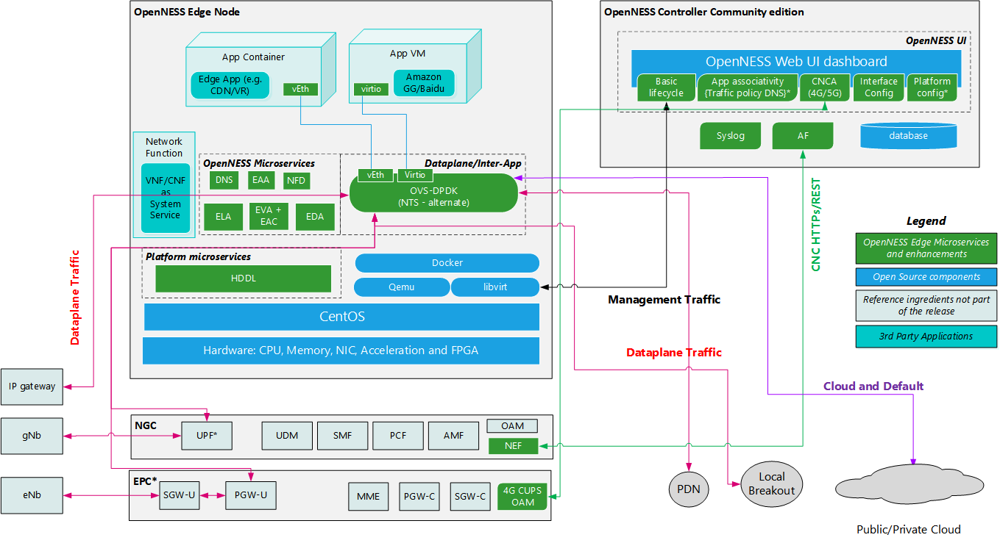

_Figure - On-Premises Edge Deployment Scenario without external Orchestrator_ 

### Network Edge Deployment Scenario
The network edge deployment scenario is depicted in Figure below. In this scenario, Edge Nodes are located  in facilities owned by a network operator (e.g., a central office, Regional Data Center), and to be part of a data network including access network (4G, 5GNR), core network (EPC, NGC), and edge computing infrastructure owned by a network operator. For economy of scale, this network is likely to be multi-tenant, and to be of very large scale (a national network operator may have thousands, or tens of thousands, of Edge Nodes). This network is likely to employ managed virtualization (e.g., OpenStack, Kubernetes) and be integrated with an operations and support system through which not only the edge computing infrastructure, but the network infrastructure, is managed.
 
In this environment, OpenNESS leverages Kubernetes based cloud-native Container orchestration stack to deploy edge cloud that can host Applications, Services and Network functions. 

> Note: When the OpenNESS Controller interfaces to an existing orchestrator like Kubernetes it does not duplicate the implementation of lifecycle management and traffic policy APIs of the Containers but it uses the existing Kubernetes APIs to execute lifecycle management and traffic policy tasks. 

OpenNESS supports network overlay and dataplane using OVN/OVS. This is the recommended dataplane when incoming and outgoing flows are based on pure IP. This is implemented using [kube-ovn](https://github.com/alauda/kube-ovn)

In this mode OVN/OVS can support: 
 - IP based Five tuple based flow filtering and forwarding
 - Same Interface used for Inter-App, management, Internet and Dataplane interface

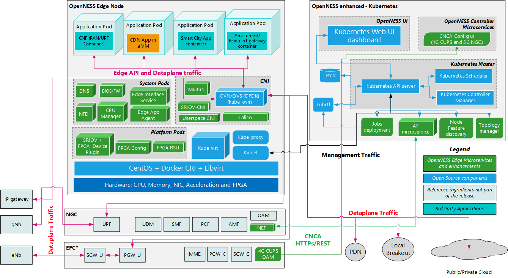

_Figure - Network Edge Deployment Scenario with OVS as dataplane_

## OpenNESS Support for Deployment flavors  
Having looked at the Deployment scenarios let us now look a the individual Deployment flavors supported by OpenNESS. Deployment flavors here refers to the types of nodes that typically are deployed at the edge using OpenNESS. Flavors are mainly categorized by the workloads that is running on the node. Below are the example of Flavors supported on the network edge:

### RAN node flavor 
RAN node here typically refers to RAN DU and CU 4G/5G nodes deployed on the edge or far edge. In some cases DU might be integrated in to the radio. The example RAN deployment flavor uses FlexRAN as reference DU. 

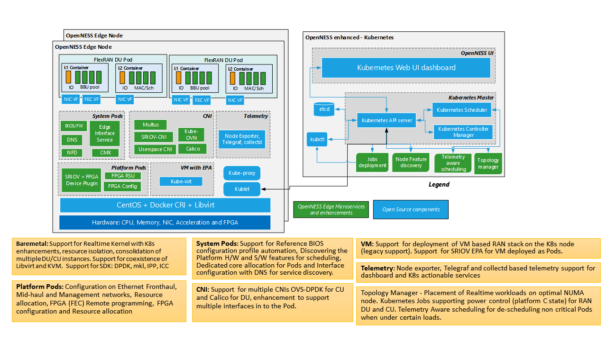

### Core node flavor 
Core nodes here typically refers to User plane and Control plane Core workloads for 4G and 5G deployed on the edge and  central location. In most of the edge deployments UPF/SPGW-U plane is located on the edge along with the applications and services. For the ease of representation the diagram shows how OpenNESS can be used to deploy both User plane and Control plane Core nodes. 

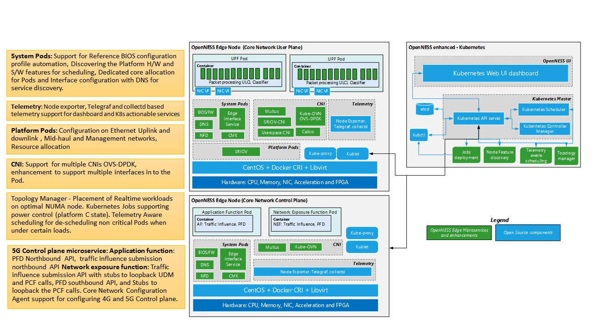

### Application node flavor 
Application nodes here typically refers to nodes running edge applications and services. The Applications can be Smart City, CDN, AR/VR, Cloud Gaming, etc. In the example flavor below Smart City application pipeline is used.  

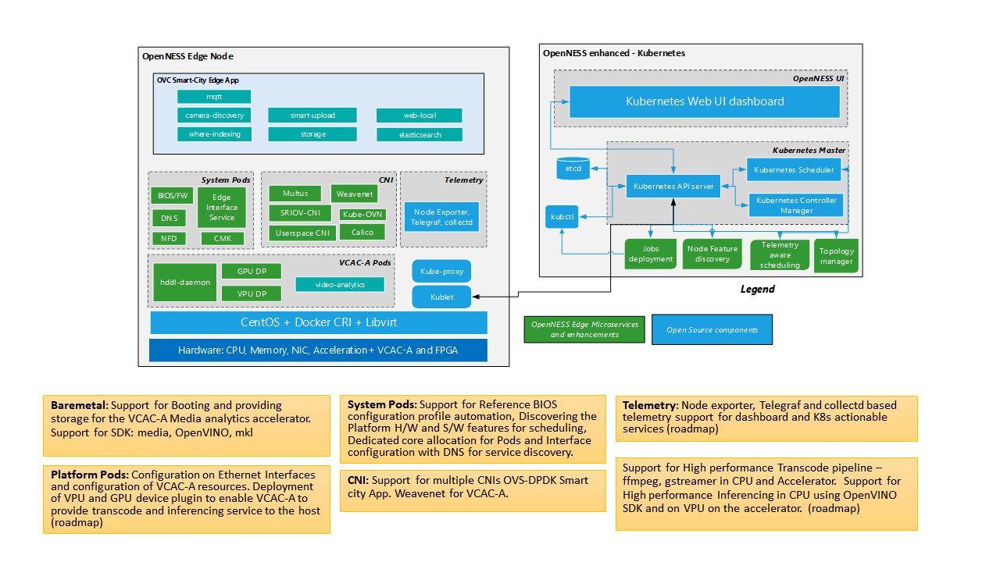

Below are the example flavors for the On-premises deployment: 

### OnPremises application node flavor 
OnPremises node typically host userplane core network function and edge applications.   

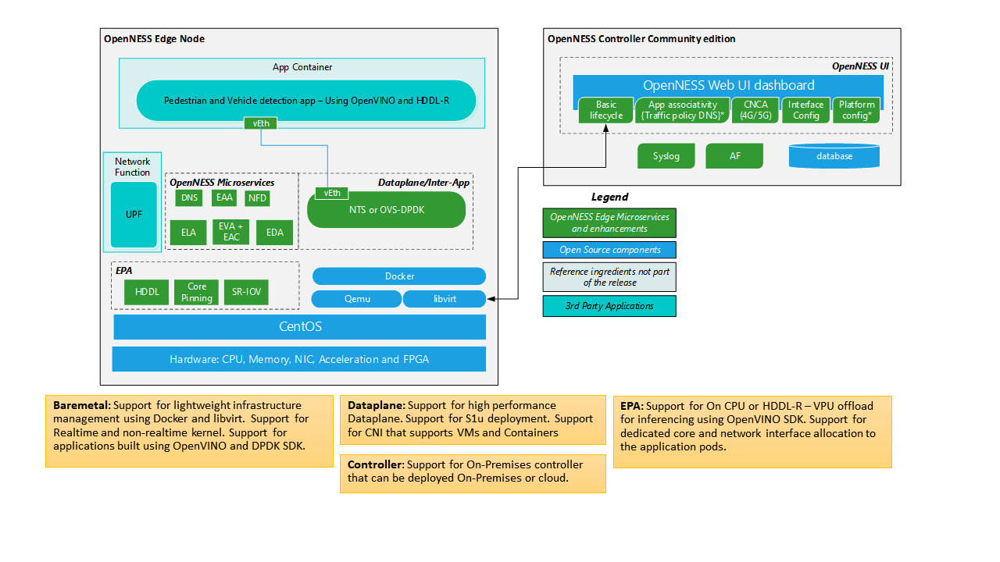

### OnPremises all-in-one node - CERA 
CERA (Converged Edge Reference Architecture) is another flavor of OnPremises where along with userplane even the Wireless access/RAN is part of the node. 


## Enhanced Platform Awareness through OpenNESS 
Enhanced Platform Awareness (EPA) represents a methodology and a related suite of changes across multiple layers of the orchestration stack targeting intelligent platform capability, configuration & capacity consumption. EPA features include Huge Pages support, NUMA topology awareness, CPU pinning, integration with OVS-DPDK, support for I/O Pass-through via SR-IOV, HDDL support, FPGA resource allocation support and many others.

So why should you consider using EPA? To achieve the optimal performance and efficiency characteristics, EPA extensions to Data Models, Orchestrators and VIMs facilitates Automation of advanced selection of capabilities and tuning parameters during the deployment of NFV solutions. EPA also enables service providers to offer differentiating and/or revenue generating services that require leveraging of specific hardware features.

OpenNESS provides a one-stop solution to integrate key EPA features that are critical for Applications (CDN, AI Inference, Transcoding, Gaming etc.) and CNF (RAN L1, L2L3 and Core) to work optimally for edge deployments. 

Edge Compute EPA- feature for Network edge and availability for CNF, Apps and Services on the edge
- CPU Manager: Support deployment of a POD with dedicated pinning using CPU manager for K8s
- SR-IOV NIC: Support deployment of a POD with dedicated SR-IOV Virtual Function (VF) from Network Interface Card (NIC)
- SR-IOV FPGA: Support deployment of a POD with dedicated SR-IOV VF from FPGA (Demonstrated through Intel® FPGA Programmable Acceleration Card PAC N3000 with FPGA IP Wireless 5G FEC/LDPC)
- Topology Manager: Supports k8s to manage the resources allocated to workloads in a Non-uniform memory access (NUMA) topology-aware manner
- BIOS/Firmware Configuration service: Use intel syscfg tool to build a Pod that is scheduled by K8s as a job that configures the BIOS/FW with the given specification
- Hugepages: Support for allocation of 1G/2M huge pages to the Pod. Huge page allocation is done through K8s
- Multus: Support for Multiple network interface in the PODs deployed by Kubernetes
- Node Feature discovery: Support detection of Silicon and Software features and automation of deployment of CNF, Applications and services
- FPGA Remote System Update service: Support Intel OPAE (fpgautil) tool to build a Pod that is scheduled by K8s as a job that updated the FPGA with the new RTL
- Real-time Kernel - Support for the K8s Edge Node running real time kernel 
- Support for running legacy application in VM mode using Kubervirt and allocation of SRI-OV ethernet interfaces to VMs 
- Non-Privileged Container: Support deployment of non-privileged pods (CNFs and Applications as reference)
  
Edge Compute EPA- feature for On-Premises edge 
- Support for allocation of Intel® Movidius™ VPUs to the OnPrem applications running in Docker containers.
- Support for dedicated core allocation to application running as VMs or Containers 
- Support for dedicated SR-IOV VF allocation to application running in VM or containers 
> Note: when using SR-IOV VFs in containers the VF is bound to the kernel driver. 
- Support for system resource allocation into the application running as container 
  - Mount point for shared storage 
  - Pass environment variables 
  - Configure the port rules 
- Non-Privileged Container: Support deployment of non-privileged containers  

## OpenNESS Edge Node Applications
OpenNESS Applications are onboarded and provisioned on the Edge Node through OpenNESS Controller in Native mode, and through K8s master in K8s mode. In K8s mode OpenNESS also supports onboarding of the Network Functions like RAN, Core, Firewall, etc. 

OpenNESS application can be categorized in different ways depending on the scenarios. 

- Depending on the OpenNESS APIs support 
  - Edge Cloud applications: Applications calling EAA APIs for providing or consuming services on the edge compute along with servicing end-users traffic 
  - Unmodified cloud applications: Applications not availing of any services on the edge compute, just servicing end-user traffic 

- Depending on the Application Execution platform 
  - Application running natively on Edge Node in a VM/Container provisioned by the OpenNESS controller 
  - Application running on Local breakout not provisioned by the OpenNESS controller 

- Depending on the servicing of end-user traffic
  - Producer Application
  - Consumer Application 

### Producer Application
OpenNESS Producer application is an edge compute application that provides services to other applications running on the edge compute platform. Producer applications do not serve end users traffic directly. They are sometimes also to as Edge services. Here are some of the characteristics of a producer app.
- It is mandatory for all producer apps to authenticate and acquire TLS 
- All producer applications need to activate if the service provided by them needs to be discoverable by other edge applications 
- A producer application can have one or more fields for which it will provide a notification update 

### Consumer Application 
OpenNESS Consumer application is an edge compute application that serves end users traffic directly. Consumer applications may or may not subscribe to the services from other producer applications on the Edge Node. Here are some of the characteristics of a consumer application.
- It is not mandatory for consumer applications to authenticate if they don't wish to call EAA APIs.  
- A consumer application can subscribe to any number of services from producer apps. Future extension can implement entitlements to consumer applications to create access control lists. 
- Producer to Consumer updates will use a web socket for notification. If there is further data to be shared between producer and consumer, other NFVi components like OVS/VPP/NIC-VF can be used for data transfer. 

### Example of Producer and Consumer Applications
The OpenNESS release includes reference producer and consumer applications.


_Figure - Example of Producer and Consumer Applications_

The consumer application is based on [OpenVINO](https://software.intel.com/en-us/openvino-toolkit)

- OpenVINO consumer app executes inference on the input video stream
- OpenVINO producer app generates notifications to the consumer app for changing the inference model
- Video input stream is captured from a webcam installed on an Embedded Linux client device
- The annotated video is streamed out of the OpenNESS Edge Node back to the client device for further data analysis

### Dynamic CPU and VPU usage 
OpenNESS APIs provide a mechanism to utilize platform resources efficiently in the Edge cloud. The OpenVINO sample application supports dynamic use of VPU or CPU for Object detection depending on the input from the Producer application. The producer application can behave as a load balancer. It also demonstrates the Application portability with OpenVINO so that it can run on a CPU or VPU. 


More details about HDDL-R support in OpenNESS for Applications using OpenVINO SDK can be found here [Using Intel® Movidius™ Myriad™ X High Density Deep Learning (HDDL) solution in OpenNESS](https://github.com/open-ness/specs/blob/master/doc/enhanced-platform-awareness/openness_hddl.md). 

### Cloud Adapter Edge compute Application
All the major Cloud Service providers are implementing frameworks to deploy edge applications that link back to their cloud via connectors. For example, Amazon Greengrass enables lambda functions to be deployed on the edge and connecting to the AWS cloud using the GreenGrass service. While it was originally intended to host this type of edge software on IoT gateways, the same framework can be utilized by Service Providers and Enterprises, to implement a multi-cloud strategy for their Edge Nodes.  

OpenNESS enables this approach by running the Greengrass Core (with the Edge software) as Edge applications on the Edge Node. They can run unchanged, or modified to utilize the EAA APIs to serve as Producer or Consumer apps on the Edge Node. By running multiple cloud connector instances from different cloud service providers on the same Edge Node, a multi-cloud experience can be easily implemented. 

OpenNESS supports this by providing the ability to deploy public cloud IOT gateways from cloud vendors like Amazon AWS IoT Greengrass and Baidu OpenEdge on edge compute platform. The existing IOT gateways can be migrated to OpenNESS as is or enhanced to call EAA APIs using extensions like Lambda functions. 


_Figure - Example of Cloud Adapter Edge Application in OpenNESS Platform_

More details about running Baidu OpenEdge as OpenNESS application can be found here [Baidu OpenEdge  Edge Application](https://github.com/open-ness/specs/blob/master/doc/cloud-adapters/openness_baiducloud.md). 

More details about running Amazon AWS IoT Greengrass as OpenNESS application can be found here  [Amazon AWS IoT Greengrass Edge Application](https://github.com/open-ness/specs/blob/master/doc/cloud-adapters/openness_awsgreengrass.md). 

## OpenNESS Microservices and APIs

The OpenNESS Edge Node and Controller are each composed of a set of microservices that interact with each other, with applications, and with other network functions (e.g., infrastructure managers, orchestrators) to accomplish their functions. The microservices expose APIs over reference points, as shown in Network Edge Deployment Scenario Figure.
 
Interaction between the OpenNESS Controller and the Edge Node is mediated by two gateway services, via gRPC Remote Procedure Calls (gRPC), a technology that provides reliable, high-performance RPC communication between microservices. APIs between the Controller and Edge Node, and internal APIs among Edge Node microservices, are implemented via gRPC. For messages to and from applications, as well as to and from the Controller and the access network, are exposed as OpenAPI (i.e., REST-ful) APIs.
The OpenNESS solution supports following APIs:
- Edge Application APIs
- Edge Application Authentication APIs
- Edge Lifecycle Management APIs
- Edge Virtualization Infrastructure APIs
- Core Network Configuration APIs for edge compute
- OpenNESS Controller APIs 

### Edge Application APIs
Edge Application APIs are implemented by the EAA. Edge Application APIs are important APIs for Edge application developers. EAA APIs are implemented as HTTPS REST. There are two types of use cases here. 
1. **Porting of existing Public/Private Cloud application to the edge compute based on OpenNESS**: This is the scenario where a customer wants to run existing apps in public cloud on OpenNESS edge without calling any APIs or changing code. In this case, the only requirement is for an Application image (VM/Container) should be uploaded to the controller and provisioned on the Edge Node using OpenNESS Controller. In this case, the Application cannot call any EAA APIs and consume services on the edge compute. It just services the end-user traffic. 
3. **Native Edge compute Application calling EAA APIs**: This is the scenario where a customer wants to develop Edge compute applications that take advantage of the Edge compute services resulting in more tactile application that responds to the changing user, network or resource scenarios. 

OpenNESS supports deployment of both types of applications mentioned above. The Edge Application Agent is a service that runs on the Edge Node and operates as a discovery service and basic message bus between applications via pubsub. The connectivity and discoverability of applications by one another is governed by an entitlement system and is controlled by policies set with the OpenNESS Controller. The entitlement system is still in its infancy, however, and currently allows all applications on the executing Edge Node to discover one another as well as publish and subscribe to all notifications. The Figure below provides the sequence diagram of the supported APIs for the application 

More details about the APIs can be found here [Edge Application APIs](https://www.openness.org/api-documentation/?api=eaa) 


_Figure - Edge Application API Sequence Diagram_

### Edge Application Authentication APIs
OpenNESS supports authentication of Edge compute apps that intend to call EAA APIs. Applications are authenticated by the Edge Node microservice issuing the requesting application a valid TLS certificate after validating the identity of the application. It should be noted that in the OpenNESS solution, the Application can only be provisioned by the OpenNESS controller. There are two categories of Applications as discussed above and here is the implication for the authentication. 
1. **Existing pubic cloud application ported to OpenNESS**: In this scenario, a customer may want to run existing apps in the public cloud on OpenNESS edge without calling any APIs or changing code. In this case the Application cannot call any EAA APIs and consume services on the edge compute. It just services the end-user traffic. So the Application will not call authentication API to acquire a TLS certificate. 
2. **Native Edge compute Application calling EAA APIs**: In this scenario, a customer may want to develop Edge compute applications that take advantage of the Edge compute services resulting in more tactile application that responds to the changing user, network or resource scenarios. Such applications should first call authentication APIs and acquire TLS certificate. Authentication of Applications that provide services to other Applications on the edge compute (Producer Apps) is  mandatory.

For applications executing on the Local breakout the Authentication is not applicable since its not provisioned by the OpenNESS controller. 

Authentication APIs are implemented as HTTP REST APIs. 

More details about the APIs can be found here [Application Authentication APIs](https://www.openness.org/api-documentation/?api=auth) 

### Edge Lifecycle Management APIs
ELA APIs are implemented by the ELA microservice on the Edge Node. The ELA runs on the Edge Node and operates as a deployment and lifecycle service for Edge applications and VNFs (Virtual Network Functions) that are needed for Edge compute deployment like e.g. 4G EPC CUPS User plane and DNS server. It also provides network interface, network zone, and application/interface policy services.

ELA APIs are implemented over gRPC. For the purpose of visualization they are converted to json and can be found here [Edge Lifecycle Management APIs](https://github.com/open-ness/specs/blob/master/schema/pb/ela.proto) 

### Edge Virtualization Infrastructure APIs
EVA APIs are implemented by the EVA microservice on the Edge Node. The EVA operates as a mediator between the infrastructure that the apps run on and the other edge components.

The EVA abstracts how applications were deployed. In order to achieve this, there is also a complementary EVA service running on the Controller that the Edge Node EVA service can call when the Edge Node was configured as a node/slave of an external orchestrator.

As an example, an RPC to list the running applications on the node is achieved by calling the Docker daemon and virsh list on the Edge Node, get its response data and show the status of the running applications.

EVA APIs are implemented over gRPC. For the purpose of visualization they are converted to json and can be found here [Edge Virtualization Infrastructure APIs](https://github.com/open-ness/specs/blob/master/schema/pb/eva.proto) 

### Core Network Configuration APIs for edge compute 

### Core Network Configuration API for 5G
OpenNESS controller community edition supports configuration of the 5G Application Function (AF) to support the Edge Cloud support. Once AF is configured it then interacts with the 5G Network Exposure Function (NEF) as per the 3GPP standard. Traffic Influence feature is implemented between AF and NEF to steer the traffic towards the Edge Cloud or what 3GPP calls Local Data Network. OpenNESS supports 3GPP Rel v15.3 for communication between AF and NEF. Traffic influence and Notifications of AF are supported by OpenNESS in the current scope. The User Plane Function (UPF) can be co-located in the Edge location or can be deployed on Edge Node platform from OpenNESS controller. 


_Figure - OpenNESS 5G end-to-end test setup_

Features supported by 5G Components of OpenNESS (AF, NEF, CNCA, WEB UI):

Traffic Influence Submission API support : 3GPP 23.502  Sec. 52.6.7 Traffic Influence Service
-	AF: Added support for traffic influence submission northbound API 
-	NEF: added support for traffic influence submission API with stubs to loopback UDM and PCF calls
-	kubectl support for traffic influence config in Network Edge mode 
-	WEB UI support for traffic influence config in OnPerm mode

OAM service 
-	Registration of AF service with 5G CP

PFD Management API support (3GPP 23.502  Sec. 52.6.3  PFD Management service)
-	AF:   Added support for PFD Northbound API
-	NEF:  Added support for PFD southbound API, and Stubs to loopback the PCF calls. 
-	kubectl: Enhanced CNCA kube-ctl plugin to configure PFD parameters 
-	WEB UI: Enhanced CNCA WEB UI to configure PFD params in OnPerm mode 

oAuth2 based authentication between 5G Network functions: (as per 3GPP Standard)
-	Implemented oAuth2 based authentication and validation 
-	AF and NEF communication channel is updated to authenticated based on oAuth2 JWT token in addition to HTTP2. 

HTTPS support 
-	Enhanced the OAM, CNCA (web-ui and kube-ctl) to HTTPS interface 

More details about the APIs can be found here [CNCA APIs](https://www.openness.org/api-documentation/?api=cups). 

Whitepaper describing the details of the Edge Computing support in 5G NGC can be found here [5G Edge Compute supports in OpenNESS](https://github.com/open-ness/specs/blob/master/doc/core-network/openness_ngc.md).

### Core Network Configuration API for 4G CUPS
As part of the OpenNESS reference edge stack the OpenNESS controller community edition is used for configuring the traffic policy for CUPS EPC to steer traffic towards the edge compute, This API is based on HTTP REST. Since 3GPP or ETSI MEC does not provide a reference for these APIs various implementation of this Edge Controller to CUPS EPC might exist. OpenNESS has tried to take the approach of minimal changes to 3GPP CUPS EPC to achieve the edge compute deployment. OpenNESS and HTTP REST APIs for the EPC CUPS is a reference implementation to enable customers using OpenNESS to integrate their own HTTP REST APIs to the EPC CUPS into the OpenNESS Controller. Special care has been taken to make these components Modular microservices. The diagram below show the LTE environment that was used for testing OpenNESS edge compute end-to-end. 


_Figure - OpenNESS LTE end-to-end test setup for CUPS deployment_

The OpenNESS reference solution provides a framework for managing multiple Edge Nodes through a centralized OpenNESS controller. In case of co-located EPC user plane and Edge Node deployment models, LTE user plane elements can be controlled through NFV infrastructure provided by OpenNESS reference solution. OpenNESS suggests HTTP based REST APIs to configure and manage the LTE user plane components through the centralized Edge controller. LTE Network Operator’s Operation and Maintenance (OAM) elements can consume these APIs to open an interface for the Edge controllers to communicate for the management of user plane nodes launched at the Edge Nodes. It is implicitly understood that OAM agent communication with EPC core components is always an implementation dependent from vendor to vendor in different operator’s environments. 

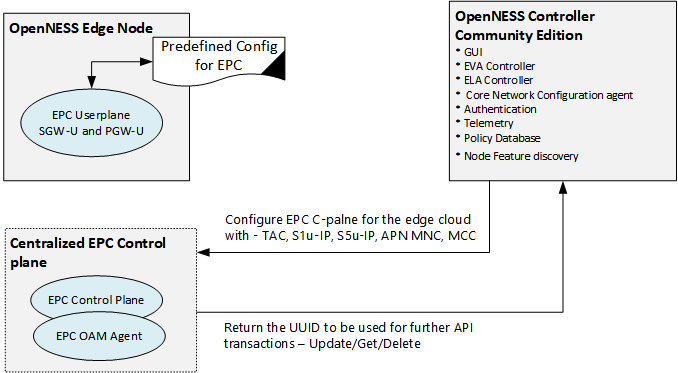     

_Figure - LTE EPC Configuration_

More details about the APIs can be found here [CNCA APIs](https://www.openness.org/api-documentation/?api=cups). 

Whitepaper describing the details of the CUPS support in EPC can be found here [4G CUPS  Edge Compute supports in OpenNESS](https://github.com/open-ness/specs/blob/master/doc/core-network/openness_epc.md).

### OpenNESS Controller APIs
OpenNESS Controller APIs are important APIs for those managing one or more OpenNESS Edge Nodes. OpenNESS Controller APIs are called by the UI frontend and can be called by external orchestrators. These APIs allow centralized management of OpenNESS Edge Nodes. The API enables a developer to maintain a list of OpenNESS Edge Nodes, configure apps, manage policies and DNS, and more. The OpenNESS Controller API represents an abstraction layer for an operations administrator. While individual OpenNESS Edge Nodes may be managed singularly, the OpenNESS Controller API allows for management in a scalable way. Furthermore, it allows for secure communication to the many Edge Nodes.

The OpenNESS Controller API is implemented using HTTP REST.

## OpenNESS OS environment
OpenNESS Controller and Edge Node are developed and tested on CentOS 7.6. OpenNESS also depends on following open-source components:
- Docker      
- Libvirt    
- Boost    
- openssl     
- qemu    
- DPDK    
- Ansible    
- MySQL Community Server    
- Amazon Web Services   
- Go libraries     

Note: OpenNESS is tested with CentOS 7.6 Pre-empt RT kernel to make sure VNFs and Applications can co-exist. There is no requirement for OpenNESS software to run on a Pre-empt RT kernel. 

Installation and configuration scripts will be provided to get the relevant version of the components to be installed on Edge Node and controller. 

## OpenNESS steps to get started
Below are typical steps involved in how to setup OpenNESS Network edge or On-Premises edge.

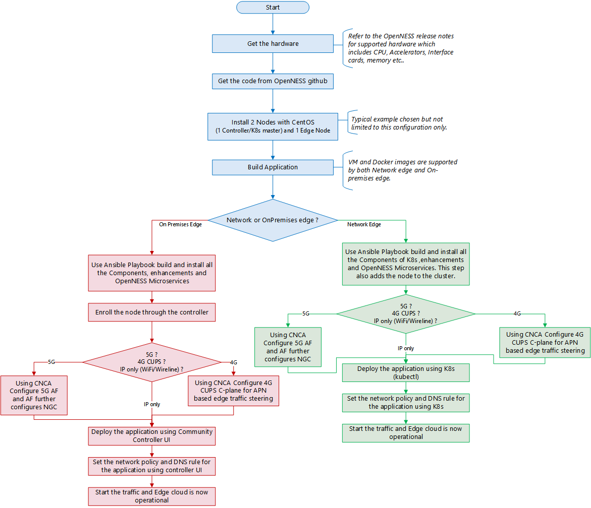     

_Figure - Setting up OpenNESS_

## OpenNESS Repository Structure
- **OpenNESS github root** [OpenNESS Github link](https://github.com/open-ness)
  - **openness-experience-kits** [openness experience kits repo](https://github.com/open-ness/openness-experience-kits): Repository containing OpenNESS playbooks to get started installing and testing various features of OpenNESS. 
  - **edgenode** [edgenode repo link](https://github.com/open-ness/edgenode): Repository containing OpenNESS Edge Node microservices, dataplane, build, installation scripts and test. 
  - **edgecontroller** [edgecontroller repo link](https://github.com/open-ness/edgecontroller): Repository containing OpenNESS Controller Community Edition microservices, webui, build, installation scripts and test. 
  - **edgeapps** [edgeapps repo link](https://github.com/open-ness/edgeapps): Repository containing Reference Edge compute applications built and tested using OpenNESS Solution APIs. This repo includes scripts for building and running IOT gateways based on Amazon AWS IoT Greengrass and Baidu OpenEdge as Edge compute Apps on OpenNESS. 
  - **specs** [specs repo link](https://github.com/open-ness/specs): Repository containing architecture, usage and implementation documentation of key components in the OpenNESS Edge compute solution. 
  - **test** [test repo link](https://github.com/open-ness/test): Repository containing integration tests of key components in the OpenNESS Edge compute solution. 
  - **common** [common repo link](https://github.com/open-ness/common): Repository containing some of the common libraries, packages that are common to OpenNESS Edge Node and OpenNESS Controller Community Edition. 
  - **epcforedge** [epcforedge repo link](https://github.com/open-ness/epcforedge): Repository containing reference implementations and reference APIs of some of the EPC components that enable Edge compute Solution.   

## Other References
- [3GPP_23401]	3rd Generation Partnership Project; Technical Specification Group Services and System Aspects; General Packet Radio Service (GPRS) enhancements for Evolved Universal Terrestrial Radio Access Network  (E-UTRAN) access.     
- [3GPP_23214]	3rd Generation Partnership Project; Technical Specification Group Services and System Aspects; Architecture enhancements for control and user plane separation of EPC nodes; Stage 2.
- [ETSI_MEC_003] ETSI GS MEC 003 V2.1.1 Multi-access Edge Computing (MEC): Framework and Reference Architecture     
- [ETSI_23501] 5G; System Architecture for the 5G System (3GPP TS 23.501 version 15.2.0 Release 15), ETSI TS 123 501.
- [OpenVINO toolkit](https://software.intel.com/en-us/openvino-toolkit).

## List of Abbreviations
- 3GPP: Third Generation Partnership Project
- CUPS: Control and User Plane Separation of EPC Nodes
- AF: Application Function
- API: Application Programming Interface
- APN: Access Point Name
- EPC: Evolved Packet Core
- ETSI: European Telecommunications Standards Institute
- FQDN: Fully Qualified Domain Name
- HTTP: Hyper Text Transfer Protocol
- IMSI: International Mobile Subscriber Identity
- JSON:	JavaScript Object Notation
- MEC: Multi-Access Edge Computing
- OpenNESS: Open Network Edge Services Software
- LTE: Long-Term Evolution
- MCC: Mobile Country Code
- MME: Mobility Management Entity
- MNC: Mobile Network Code
- NEF: Network Exposure Function
- OAM: Operations, Administration and Maintenance
- PDN: Packet Data Network
- PFCP: Packet Forwarding Control Protocol- SGW: Serving Gateway- PGW: PDN Gateway
- PGW-C: PDN Gateway - Control Plane Function
- PGW-U: PDN Gatgeway - User Plane Function
- REST: REpresentational State Transfer
- SGW-C: Serving Gateway - Control Plane Function
- SGW-U: Serving Gateway - User Plane Function
- TAC: Tracking Area Code
- UE: User Equipment (in the context of LTE)
- VIM: Virtual Infrastructure Manager 
- UUID: Universally Unique IDentifier 
- AMF: Access and Mobility Mgmt Function
- SMF: Session Management Function
- AUSF: Authentication Server Function
- NEF: Network Exposure Function
- NRF: Network function Repository Function
- UDM: Unified Data Management
- PCF: Policy Control Function
- UPF: User Plane Function
- DN: Data Network
- AF: Application Function
- SR-IOV: Single Root I/O Virtualization
- NUMA: Non-Uniform Memory Access
- COTS: Commercial Off-The-Shelf 
