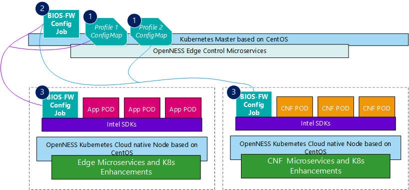

SPDX-License-Identifier: Apache-2.0    
Copyright (c) 2019 Intel Corporation

# BIOS and Firmware Configuration on OpenNESS Platform

- [BIOS and Firmware Configuration on OpenNESS Platform](#bios-and-firmware-configuration-on-openness-platform)
  - [Overview](#overview)
  - [Usecase for edge](#usecase-for-edge)
  - [Details: BIOS and Firmware Configuration on OpenNESS Network Edge](#details-bios-and-firmware-configuration-on-openness-network-edge)
    - [Setup](#setup)
    - [Usage](#usage)
  - [Reference](#reference)

## Overview 

BIOS and Firmware are the fundamental platform configurations of a typical Commercial off-the-shelf (COTS) platform. BIOS and Firmware configuration has very low level configurations that can determine the environment that will be available for the Network Functions or Applications. A typical BIOS configuration that would be of relevance for a network function or application may include CPU configuration, Cache and Memory configuration, PCIe Configuration, Power and Performance configuration, etc. Some Network Functions and Applications need certain BIOS and Firmware settings to be configured in a specific way for optimal functionality and behavior. 

## Usecase for edge 

Let's take an AI Inference Application as an example that uses an Accelerator like an FPGA. To get optimal performance, when this application is deployed by the Resource Orchestrator, it is recommended to place the Application on the same Node and CPU Socket to which the Accelerator is attached. To ensure this, NUMA, PCIe Memory mapped IO and Cache configuration needs to be configured optimally. Similarly for a Network Function like a Base station or Core network instruction set, cache and hyper threading play an important role in the performance and density. 

OpenNESS provides a reference implementation demonstrating how to configure the low level platform settings like BIOS and Firmware and the capability to check if they are configured as per a required profile. To implement this feature, OpenNESS uses the Intel® System Configuration Utility. The Intel® System Configuration Utility (Syscfg) is a command-line utility that can be used to save and restore BIOS and firmware settings to a file or to set and display individual settings. 

> Important Note: Intel® System Configuration Utility is only supported on certain Intel® Server platforms. Please refer to the Intel® System Configuration Utility user guide for the supported server products. 

> Important Note: Intel® System Configuration Utility is not intended for and should not be used on any non-Intel Server Products. 

The OpenNESS Network Edge implementation goes a step further and provides an automated process using Kubernetes to save and restore BIOS and firmware settings. To do this, the Intel® System Configuration Utility is packaged as a Pod deployed as a Kubernetes job that uses ConfigMap. This ConfigMap provides a mount point that has the BIOS and Firmware profile that needs to be used for the Worker node. A platform reboot is required for the BIOS and Firmware configuration to be applied. To enable this, the BIOS and Firmware Job is deployed as a privileged Pod. 

 

 _Figure - BIOS and Firmware configuration on OpenNESS_

## Details: BIOS and Firmware Configuration on OpenNESS Network Edge 

BIOS and Firmware Configuration feature is wrapped in a kubectl plugin.
Knowledge of Intel SYSCFG utility is required for usage.
Intel SYSCFG must be manually downloaded by user after accepting the license.

### Setup

In order to enable BIOSFW following steps need to be performed:
1. `biosfw/master` role needs to be uncommented in OpenNESS Experience Kits' `ne_controller.yml`
2. SYSCFG package must be downloaded and stored inside OpenNESS Experience Kits' `biosfw/` directory as a syscfg_package.zip, i.e.
`openness-experience-kits/biosfw/syscfg_package.zip`
3. `biosfw/worker` role needs to be uncommented in OpenNESS Experience Kits' `ne_node.yml`
4. OpenNESS Experience Kits' NetworkEdge deployment for both controller and nodes can be started.

### Usage

> NOTE: BIOSFW does not verify if motherboard is compliant with syscfg tool. It is assumed that syscfg verifies the motherboard and requirements.

* `kubectl biosfw --help` to learn about usage
* `kubectl biosfw save <node_name> saved_bios.ini` to get BIOS setting of the `<node_name>` node to `saved_bios.ini`
* `kubectl biosfw restore <node_name> bios_to_restore.ini` to restore BIOS settings on `<node_name>` node from file `bios_to_restore.ini`
* `kubectl biosfw restore <node_name> bios_to_restore.ini admin_password` to restore BIOS settings on `<node_name>` node using BIOS Admin Password (last argument)
* `kubectl biosfw direct <node_name> /i` to run `syscfg /i` on `<node_name>` node
* `kubectl biosfw direct <node_name> /d BIOSSETTINGS "Quiet Boot"` to run `syscfg /d BIOSSETTINGS "Quiet Boot"` on `<node_name>` node

## Reference
- [Intel Save and Restore System Configuration Utility (SYSCFG)](https://downloadcenter.intel.com/download/28713/Save-and-Restore-System-Configuration-Utility-SYSCFG-)

