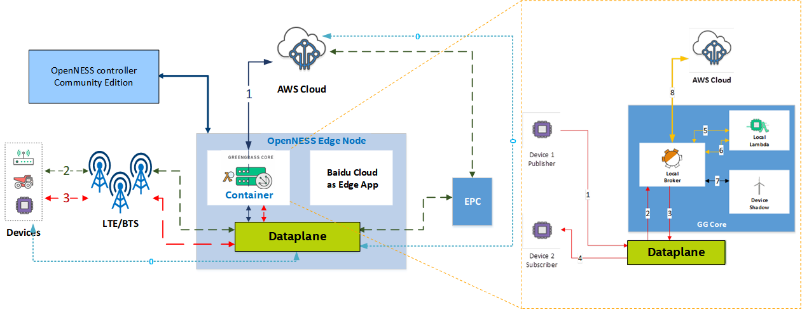

SPDX-License-Identifier: Apache-2.0      
Copyright © 2019 Intel Corporation and Smart-Edge.com, Inc.         

# OpenNESS Integration with AWS Greengrass    

## Overview
This application note will provide guidelines and examples on:
- Creating AWS Greengrass Docker container
- Deployment AWS Greengrass on OpenNESS platform.

OpenNESS is an open source software platform that enables easy orchestration of edge services across diverse network platform and access technologies in multi-cloud environments. It is inspired by the edge computing architecture defined by the ETSI Multi-access Edge Computing standards (e.g., [ETSI_MEC 003]), as well as the 5G network architecture ([3GPP_23501]). Figure 1 depicts the high level architecture of OpenNESS.

Certain commercial cloud service providers (CSPs), such as Amazon, have the capability of running cloud applications on edge platforms external to their cloud. In the case of AWS, this capability is provided by the Greengrass product. In Greengrass, a cloud connector component called Greengrass Core is ported to the edge platform, and interoperates with the AWS cloud to allow the cloud to deploy and provision cloud applications on the edge platform.

The OpenNESS platform supports Amazon Greengrass. This Application note describes how to deploy Greengrass on the OpenNESS platform.


Figure 1 - OpenNESS Architecture
## Run Greengrass on OpenNESS

Figure 2 shows a system consisting of AWS, AWS Greengrass, and an OpenNESS platform. In this architecture, the Greengrass Core runs as an edge application on the OpenNESS Edge Node. It is deployed as a Docker Container, and provides a network interface to the AWS Cloud. Greengrass Core uses edge node services to provision cloud applications, which run on the edge node as edge applications.

From the point of view of AWS Cloud, Greengrass Core and the applications appear to be components meeting the Greengrass specification and running on an external system. Greengrass Core can run Lambdas within Greengrass core, as normal. Greengrass Core, and the lambdas, have ports from external devices to which traffic is steered by the OpenNESS data plane.

From the point of view of OpenNESS, Greengrass Core is an edge service managed by the edge platform.



Figure 2 - Amazon AWS greengrass OpenNESS integrated solution 

This section describe how to setup and run AWS Greengrass on openNESS in a Docker container.
### Running AWS IoT Greengrass in a Docker Container

#### Download Dockerfile from AWS

AWS provides a Dockerfile and Docker image to enable running AWS IoT Greengrass in a Docker container.
The procedures for downloading and using it are in the AWS IoT Greengrass Developer Guide [AWS IoT Greengrass Developer Guide](https://docs.aws.amazon.com/greengrass/latest/developerguide). 

In the Downloads section of "What is AWS IoT Greengrass" <https://docs.aws.amazon.com/greengrass/latest/developerguide/what-is-gg.html#gg-docker-download>, find and download the Docker package.

#### AWS IoT Greengrass

Go to the "Configure AWS IoT Greengrass on AWS IoT" section of AWS IoT Greengrass Developer Guide (<https://docs.aws.amazon.com/greengrass/latest/developerguide/gg-config.html>) and follow it until you download and store your Core's security resources as a tar.gz.

Unzip its content into the same diectory where the Dockerfile is.

#### Modify Dockerfile and docker-compose file

Modify the ```Dockerfile``` and ```docker-compose.yml``` file before taking next steps.

Add the following section in the Dockerfile:

```docker

\# Copy certs files

COPY "./certs/*" /greengrass/certs/

COPY "./config/*" /greengrass/config/

RUN chmod 444 /greengrass/config/config.json

```

In ```docker-compose.yml``` file comment out ```volumes``` section with ```#``` sign:

```docker
\#    volumes:

\#      - ./certs:/greengrass/certs

\\#      - ./config:/greengrass/config

\#      - ./deployment:/greengrass/ggc/deployment

\#      - ./log:/greengrass/ggc/var/log

```

#### Build a docker container image with credentials

Go to the folder with Dockerfile and run the following command:

```docker-compose up --build -d```

Now you have to commit changes to the image:

```docker commit aws-iot-greengrass aws-iot-greengrass```

Then save the modified container image into the file:

```docker save aws-iot-greengrass > aws-iot-greengrass.tar.gz```

Now deploy ```aws-iot-greengrass.tar.gz``` file in OpenNESS according to the Controller User Guide.

### Greengrass Deployment on AWS IoT

After Greengrass container is run by the OpenNESS Controller, follow the Greengrass setup and deployment steps in the AWS IoT Greengrass Developer Guide.
