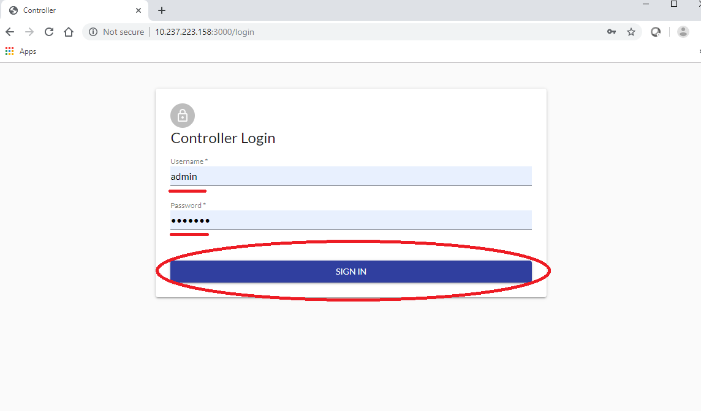

SPDX-License-Identifier: Apache-2.0    
Copyright © 2019 Intel Corporation and Smart-Edge.com, Inc.    

# OpenNESS How to guide 

* [Introduction](#introduction)
* [Overview](#overview)
  * [First login](#first-login)
  * [Enrollment](#enrollment)
  * [NTS Configuration](#nts-configuration)
    * [Displaying Appliance Interfaces](#displaying-appliance-interfaces)
    * [Creating Traffic Policy](#creating-traffic-policy)
    * [Adding Traffic Policy to Interface](#adding-traffic-policy-to-interface)
    * [Configuring Interface](#configuring-interface)
    * [Starting NTS](#starting-nts)
  * [Creating apps](#creating-apps)
  * [Managing Traffic Rules](#managing-traffic-rules)
  * [Managing DNS Rules](#managing-dns-rules)

##Introduction
The aim of this guide is to familiarize the user with OpenNESS controller's User Interface. This "How to" guide will provide instructions on how to create a sample configuration via UI.
 
## Overview
TBA

### First login
In order to access the UI the user needs to provide credentials during login.

Prerequisites:
- An internet browser to access the login page.
- REACT_APP_CONTROLLER_API='http://<Controller_IP_address>:8080' added to Controller's "~/controller-ce/ui/controller/.env.production" file.
- If working behind proxy or firewall approporiate ports open.
- Controller set up (including the UI application) and running.

The following steps need to be done for succesfull login:
- Open internet browser.
- Type in http://10.237.223.158:3000/login in address bar.
- Enter you username and password (default username: admin) (the password to be used is the same that which was provided during Controller bringup with the "-adminPass <pass>" parameter).
- Click on "SIGN IN" button.

### enrollment

In order for the Controller and Appliance to work together the Appliance needs to enroll with the Controller. The appliance will continiously try to connect to the controller until its serial key is recognised by the Controller.

Prerequisites:
- Controller's IP address must be provided in Appliance's "scripts/ansible/deploy_server/vars/defaults.yml" file. This IP needs to be added/edited in the file in following format: enrollment_endpoint: "<Controller_IP_address>:8081"
- Controller's ROOT CA  needs to be added to "/etc/pki/tls/certs/controller-root-ca.pem" on Appliance. The Controller's ROOT CA is printed out to the terminal during Controller bring up.
- The Appliance's deployment script has been started.
- Upon Appliance's deployment a Serial Key has been printed out to the terminal and retrieved to be used during enrollment.
- User has logged in to UI

In order to enroll and add new Appliance to be managed by the Controller the following steps are to be taken:
- Navigate to Nodes tab.
- Click on 'ADD EDGE NODE' button

- Enter previously obtained Appliance Serial Key into 'Serial*' field
- Enter the name and location of Appliance
- Press 'ADD EDGE NODE'

- Check that your Appliance is visible under 'List of Edge Nodes' (Also at this stage the Ansible script for bringing up Appliance should succesfully finish executing)

### NTS Configuration
TBA

#### Displaying Appliance's Interfaces
TBA

#### Creating Traffic Policy
TBA

#### Adding Traffic Policy to Interface
TBA

#### Configuring Interface
TBA

#### Starting NTS
TBA

### Creating apps
TBA

### Managing Traffic Rules
TBA

### Managing DNS Rules
TBA