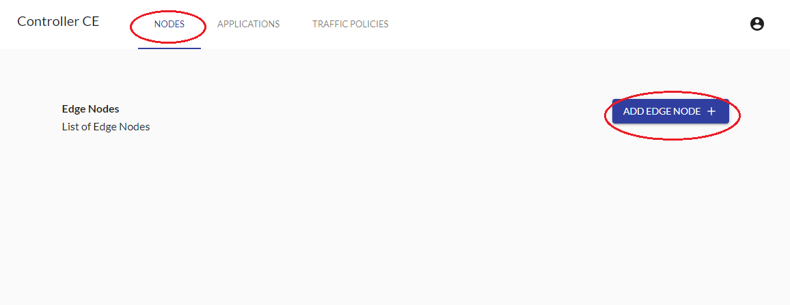
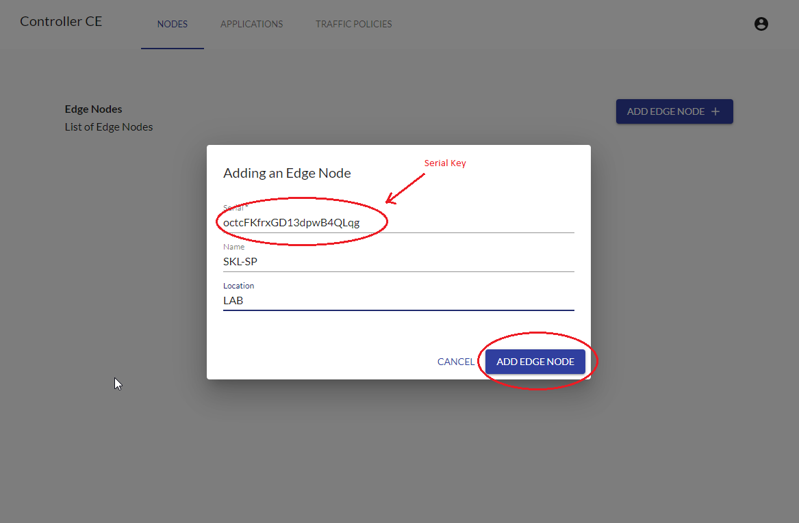
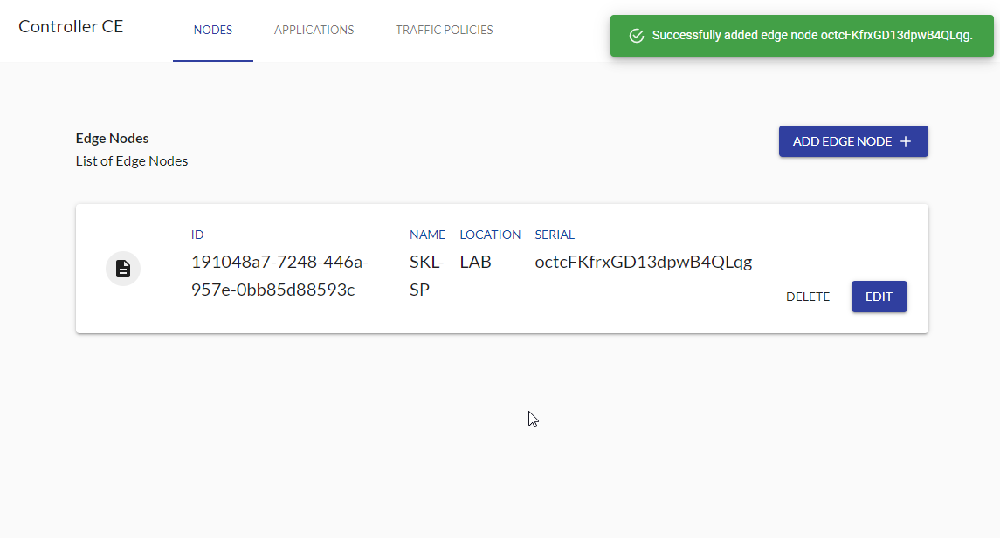
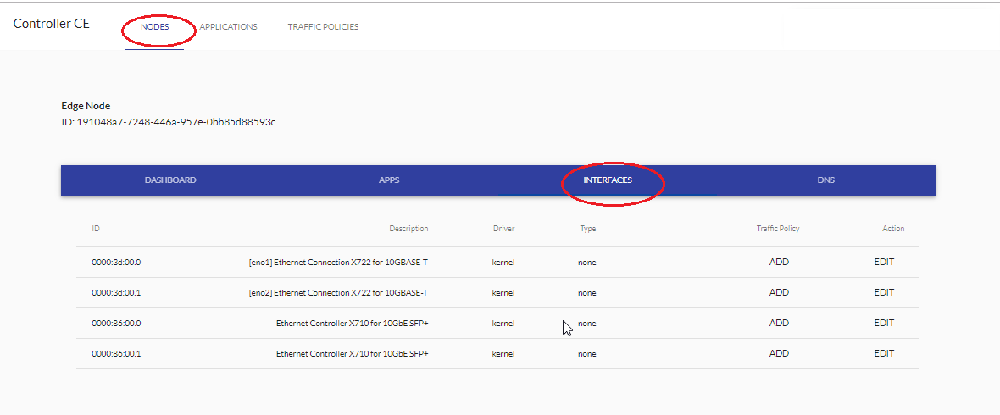
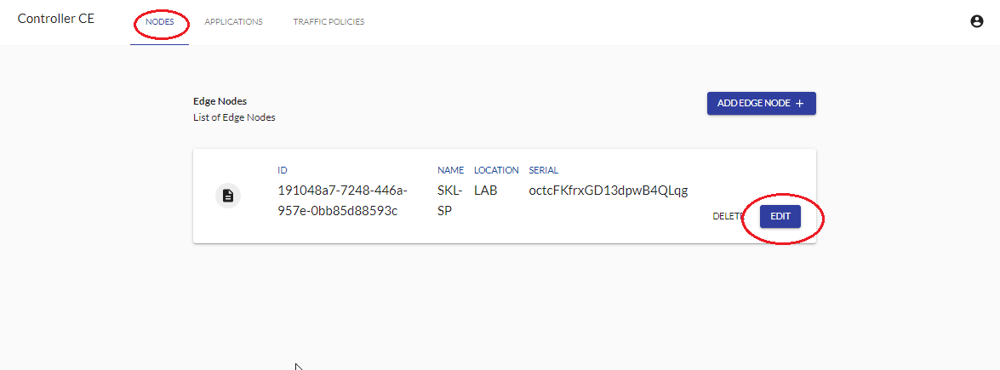
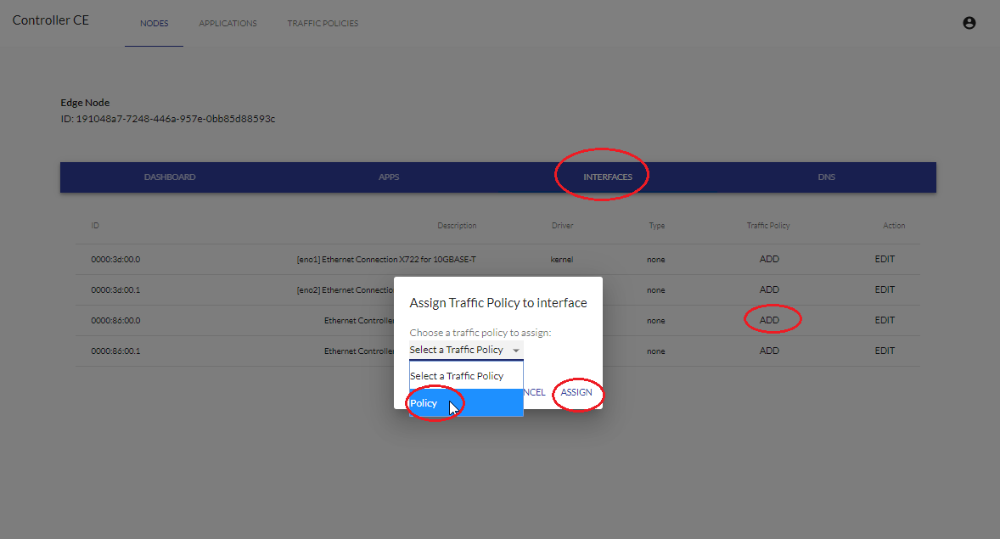
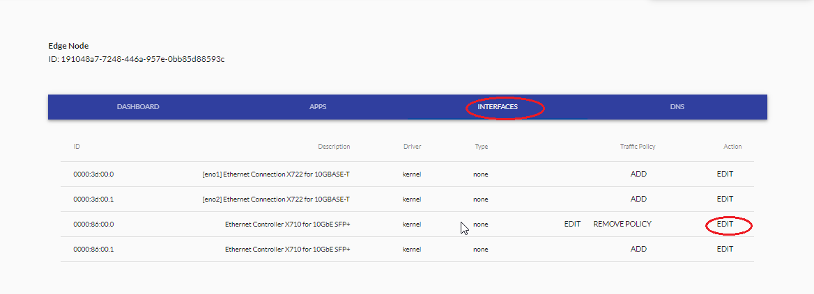
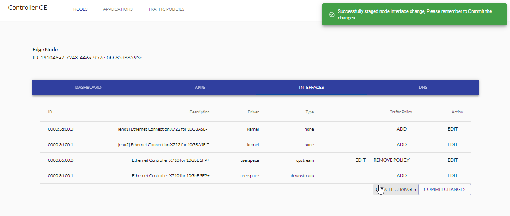
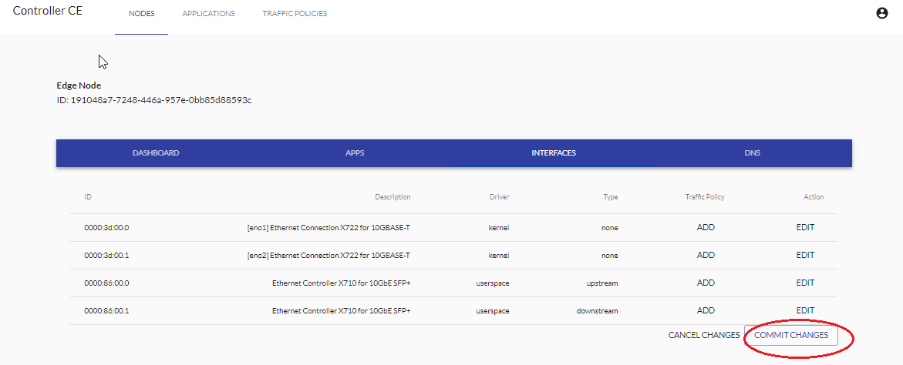
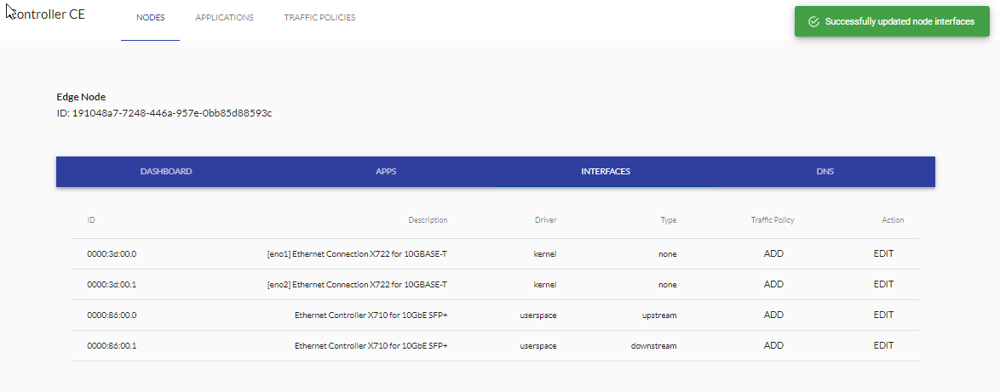

SPDX-License-Identifier: Apache-2.0    
Copyright © 2019 Intel Corporation and Smart-Edge.com, Inc.    

# OpenNESS How to guide 

* [Introduction](#introduction)
* [Instructions](#Instructions)
  * [Prerequisites](#prerequisites)
    * [Creating HTTPS server for image download](#creating-https-server-for-image-download)
  * [First login](#first-login)
  * [Enrollment](#enrollment)
  * [NTS Configuration](#nts-configuration)
    * [Displaying Edge Node Interfaces](#displaying-Edge-Node-interfaces)
    * [Creating Traffic Policy](#creating-traffic-policy)
    * [Adding Traffic Policy to Interface](#adding-traffic-policy-to-interface)
    * [Configuring Interface](#configuring-interface)
    * [Starting NTS](#starting-nts)
  * [Creating Applications](#creating-applications)
  * [Deploying Applications](#deploying-applications)
  * [Managing Traffic Rules](#managing-traffic-rules)
  * [Managing DNS Rules](#managing-dns-rules)

## Introduction
The aim of this guide is to familiarize the user with OpenNESS controller's User Interface. This "How to" guide will provide instructions on how to create a sample configuration via UI.
 
## Instructions
TBD - Add description

### Prerequisites
TBD - Add description

#### Creating HTTPS server for image download
TBD - Add steps to create https server

### First login
In order to access the UI the user needs to provide credentials during login.

Prerequisites:
- An internet browser to access the login page.
- REACT_APP_CONTROLLER_API='http://<Controller_IP_address>:8080' added to Controller's "~/controller-ce/ui/controller/.env.production" file.
- If working behind proxy or firewall appropriate ports open.
- Controller set up (including the UI application) and running.

The following steps need to be done for successful login:
- Open internet browser.
- Type in http://10.237.223.158:3000/login in address bar.
- Enter you username and password (default username: admin) (the password to be used is the same that which was provided during Controller bring-up with the "-adminPass <pass>" parameter).
- Click on "SIGN IN" button.

### Enrollment

In order for the Controller and Edge Node to work together the Edge Node needs to enroll with the Controller. The Edge Node will continuously try to connect to the controller until its serial key is recognized by the Controller.

Prerequisites:
- Controller's IP address must be provided in Edge Node's "scripts/ansible/deploy_server/vars/defaults.yml" file. This IP needs to be added/edited in the file in following format: enrollment_endpoint: "<Controller_IP_address>:8081"
- Controller's ROOT CA  needs to be added to "/etc/pki/tls/certs/controller-root-ca.pem" on Edge Node. The Controller's ROOT CA is printed out to the terminal during Controller bring up.
- The Edge Node's deployment script has been started.
- Upon Edge Node's deployment a Serial Key has been printed out to the terminal and retrieved to be used during enrollment.
- User has logged in to UI.

In order to enroll and add new Edge Node to be managed by the Controller the following steps are to be taken:
- Navigate to 'NODES' tab.
- Click on 'ADD EDGE NODE' button.

- Enter previously obtained Edge Node Serial Key into 'Serial*' field.
- Enter the name and location of Edge Node.
- Press 'ADD EDGE NODE'.

- Check that your Edge Node is visible under 'List of Edge Nodes' (Also at this stage the Ansible script for bringing up Edge Node should successfully finish executing).

### NTS Configuration
TBA

#### Displaying Edge Node's Interfaces
Prerequisites:
- Enrollment phase completed successfully.
- User is logged in to UI.

To check the interfaces available on the Edge Node execute following steps:
- From UI go to 'NODES' tab.
- Find you Edge Node on the list.
- Click 'EDIT'.

- Navigate to 'INTERFACES' tab.
- Available interfaces are listed.

#### Creating Traffic Policy
Prerequisites:
- Enrollment phase completed successfully.
- User is logged in to UI.

The steps to create a sample traffic policy are as follows:
- From UI navigate to 'TRAFFIC POLICIES' tab.
- Click 'ADD POLICY'.

- Give policy a name.
- Click 'ADD' next to 'Traffic Rules*' field.
- Fill in following fields:
  - Description: "Sample Description"
  - Priority: 99
  - Source -> IP Filter -> IP Address: 1.1.1.1
  - Source -> IP Filter -> Mask: 24
  - Source -> IP Filter -> Begin Port: 10
  - Source -> IP Filter -> End Port: 20
  - Source -> IP Filter -> Protocol: all
  - Target -> Description: "Sample Description"
  - Target -> Action: accept
- Click on "CREATE".

After creating Traffic Policy it will be visible under 'List of Traffic Policies' in 'TRAFFIC POLICIES' tab.

#### Adding Traffic Policy to Interface
Prerequisites:
- Enrollment phase completed successfully.
- User is logged in to UI.
- Traffic Policy Created.

To add a previously created traffic policy to an interface available on Edge Node the following steps need to be completed:
- From UI navigate to "NODES" tab.
- Find Edge Node on the 'List Of Edge Nodes'.
- Click "EDIT".

- Navigate to "INTERFACES" tab.
- Find desired interface which will be used to add traffic policy.
- Click 'ADD' under 'Traffic Policy' column for that interface.
- A window titled 'Assign Traffic Policy to interface' will pop-up. Select a previously created traffic policy.
- Click on 'ASSIGN'.

On success the user is able to see 'EDIT' and 'REMOVE POLICY' buttons under 'Traffic Policy' column for desired interface. These buttons can be respectively used for editing and removing traffic rule policy on that interface.

#### Configuring Interface
Prerequisites:
- Enrollment phase completed successfully.
- User is logged in to UI.

In order to configure interface available on the Edge Node for the NTS the following steps are to be taken:
- From UI navigate to 'INTERFACES' tab of the Edge Node.
- Find the interface to be used in the interface list and click 'EDIT' button under 'Action' column for that interface.

- A window will pop-up titled "Edit Interface". The following fields need to be set:
  - Driver: userspace
  - Type: upstream
  - Fall-back Interface: PCI address of another available interface ie. '0000:3d:00.1'
- Click 'SAVE'.

- The interface's 'Driver' and 'Type' columns will reflect changes made.

#### Starting NTS
Prerequisite:
- Enrollment phase completed successfully.
- User is logged in to UI.
- Interfaces to be used by NTS configured correctly.

Note: In this example 2 interfaces are used by NTS. One interface of 'Type: upstream' and a second interface of 'Type: downstream'.

Once the interfaces are configured accordingly the following steps need to be done:
- From UI navigate to 'INTERFACES' tab of the Edge Node.
- Click 'COMMIT CHANGES'

- NTS will start

### Creating Applications
Prerequisite:
- Enrollment phase completed successfully.
- User is logged in to UI.
- User has access to a HTTPS server providing a downloadable copy of Docker container image or VM image.
- A saved copy of Docker image or VM image in a location accessible by above HTTPS server.

To add an application to list of applications managed by Controller following steps need to be taken:

- From UI navigate to 'APPLICATIONS' tab.
- Click on 'ADD APPLICATION' button.

- After 'Add an Application' window pops up add details as per following example:
  - Name: SampleApp
  - Type: Container
  - Version: 1
  - Vendor: vendor
  - Description: description
  - Cores: 2
  - Memory: 100
  - Source: https://<IP_address_of_https_server_storing_the_image>/image_file_name
- Then memory unit used is MB. A sample path to image could be https://192.10.10.10/sample_docker_app.tar.gz.
- Click 'UPLOAD APPLICATION'

- The appliaction will be displayed in Controller's 'List of Applications'.

### Deploying Applications
TBD

### Managing Traffic Rules
TBD

### Managing DNS Rules
TBD